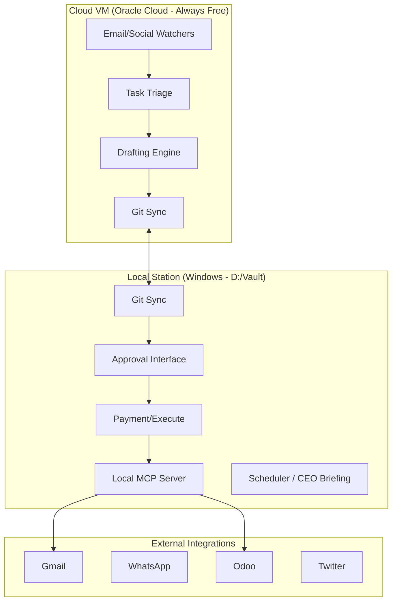

# Architecture Documentation — AI Employee (Platinum Tier)

## Overview
The Personal AI Employee is a multi-tier autonomous agent system designed to handle business operations, accounting, and communication. It transitions from a local-only setup (Gold Tier) to a hybrid local-cloud setup (Platinum Tier) for 24/7 reliability.

## System Architecture

## Key Components

### 1. Watchers (Python/Playwright)
- Monitor Gmail, WhatsApp, and Social Media channels.
- Convert incoming events into tasks in the `/Tasks` folder.
- Run 24/7 on the Cloud VM using PM2.

### 2. MCP Servers (Node.js/JSON-RPC)
- Provide a standardized interface for interacting with external tools (Odoo, Gmail API).
- Support both Mock and Live modes for safe testing.

### 3. Triage & Reasoning (Claude Code / Ralph Wiggum)
- Autonomous logic that iterates on tasks until completion.
- Uses a local reasoner fallback if the main LLM is unavailable.

### 4. Coordination (Claim-by-Move)
- Files move through a pipeline: `Needs_Action` -> `Pending_Approval` -> `Approved` -> `Done`.
- Local and Cloud instances coordinate by moving files between folders (synced via Git).

## Security
- Secrets (API keys, tokens) are stored in `.env` files and never synced to Git.
- Financial actions (payments, invoices) require human approval at the local level.
- Multi-factor authentication is enforced for cloud access.
