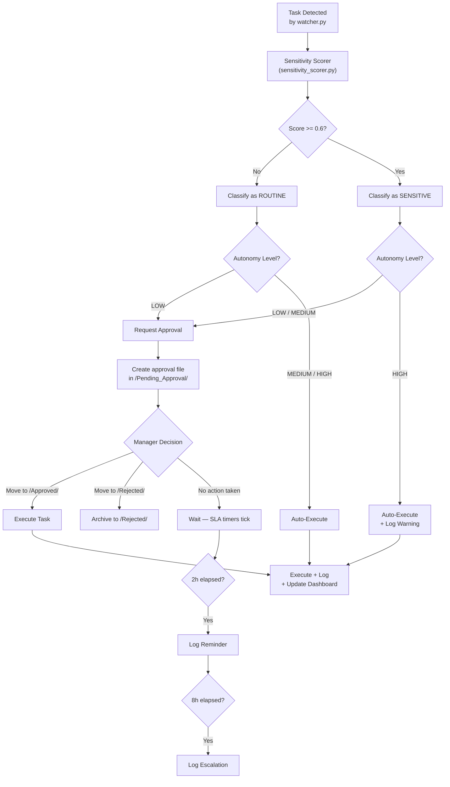
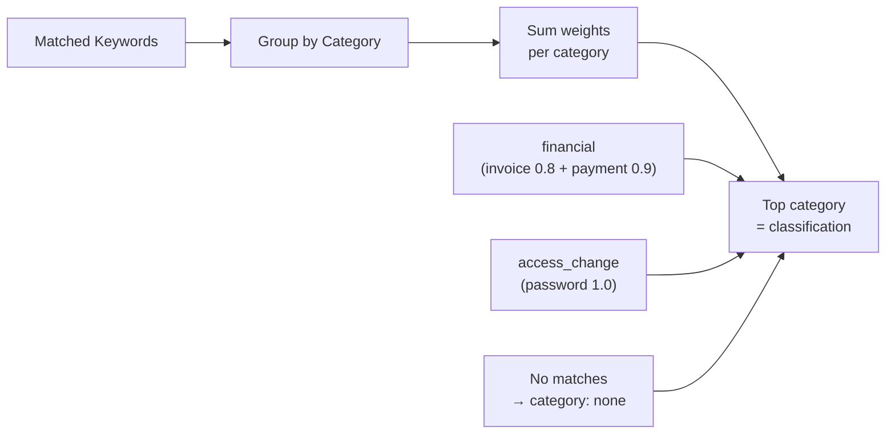
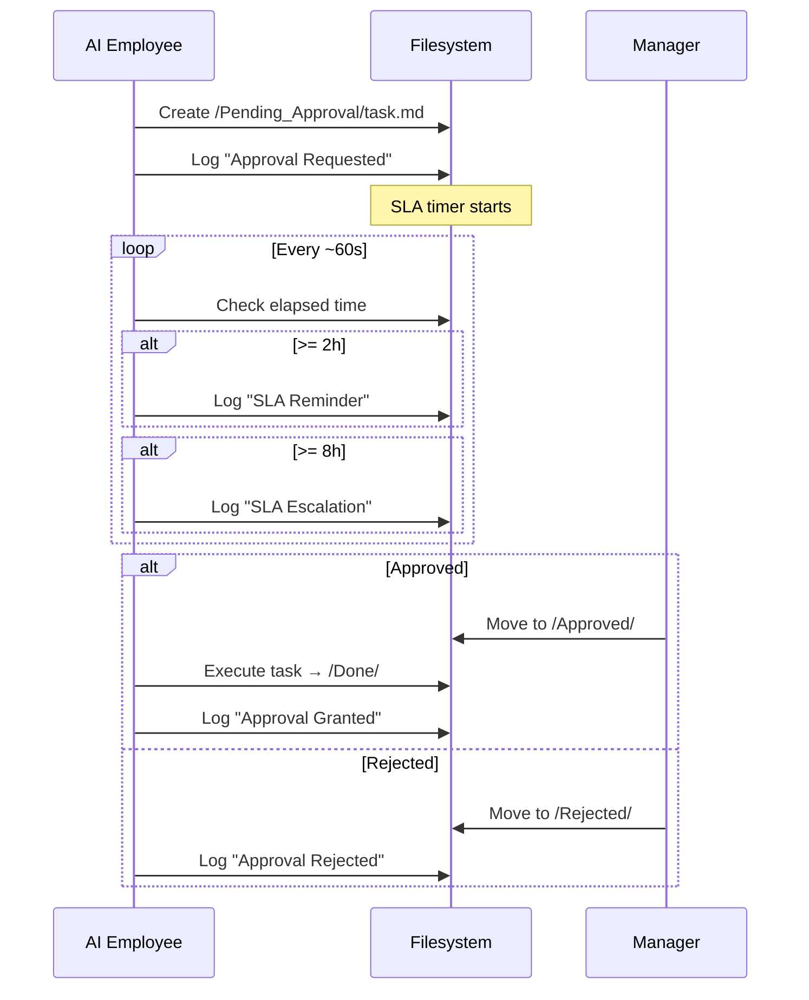

# Approval Workflow — Hakathone-0 (Digital FTE)

This document describes the complete approval routing logic, from sensitivity detection through approval resolution and execution.

> **Disclaimer:** Approval requires **manual file moves** on the filesystem. No notifications, no UI, no webhooks. All external APIs are simulated.

---

## 1. Workflow Overview



## 2. Sensitivity Scoring Engine

The `sensitivity_scorer.py` module computes a risk score for each task using three mechanisms applied additively.

### 2.1 Scoring Algorithm

```python
raw_score = Σ(matched_keyword_weights) + Σ(context_boosts) + Σ(context_reductions)
final_score = clamp(raw_score, 0.0, 1.0)
requires_approval = (final_score >= threshold)
```

- **Threshold:** `0.6` (configurable via `sensitivity.threshold` in `config.yaml`)
- **Score range:** 0.0 (no risk) to 1.0 (maximum risk)
- **Matching:** Case-insensitive substring matching for keywords; word-boundary matching for context pairs

### 2.2 Weighted Keyword Table

| Keyword | Weight | Category | Risk Level |
|---------|--------|----------|-----------|
| `password` | 1.0 | `access_change` | Critical |
| `credential` | 0.9 | `access_change` | High |
| `delete` | 0.9 | `data_deletion` | High |
| `payment` | 0.9 | `financial` | High |
| `invoice` | 0.8 | `financial` | High |
| `refund` | 0.8 | `financial` | High |
| `permission` | 0.7 | `access_change` | Medium |
| `email` | 0.6 | `external_communication` | Medium |
| `access` | 0.6 | `access_change` | Medium |
| `client` | 0.5 | `external_communication` | Medium |

All matching keywords contribute additively — a task mentioning both "payment" (0.9) and "invoice" (0.8) scores at least 1.7 before clamping.

### 2.3 Context Modifiers (Boosters)

Word pairs that co-occur in the task text **increase** the score:

| Word Pair | Boost | Rationale |
|-----------|-------|-----------|
| email + client | +0.3 | External communication to a specific party |
| email + external | +0.2 | Outbound communication |
| payment + invoice | +0.2 | Active financial transaction |
| delete + database | +0.3 | Destructive operation on persistent data |
| delete + production | +0.3 | Production environment impact |
| access + admin | +0.3 | Privileged access modification |
| password + reset | +0.2 | Credential modification |
| credential + share | +0.3 | Credential exposure risk |

### 2.4 Context Modifiers (Reducers)

Word pairs that indicate **lower risk** reduce the score:

| Word Pair | Reduction | Rationale |
|-----------|-----------|-----------|
| email + internal | -0.2 | Internal-only, not external |
| email + notification | -0.15 | System notification, not personal |
| delete + draft | -0.2 | Removing a draft, not live data |
| delete + temp | -0.2 | Temporary file cleanup |
| access + read | -0.1 | Read-only access, not write |

### 2.5 Category Classification

The top category by cumulative keyword weight determines the task's classification:



### 2.6 Worked Examples

**Example 1: "Send an invoice to the client for $500 payment"**

| Match | Weight |
|-------|--------|
| invoice | +0.8 |
| client | +0.5 |
| payment | +0.9 |
| context(payment+invoice) | +0.2 |
| **Raw total** | **2.4** |
| **Clamped score** | **1.0** |

Result: `score=1.0`, `category=financial`, `requires_approval=true`

**Example 2: "Prepare weekly internal report for the team"**

| Match | Weight |
|-------|--------|
| (none) | 0.0 |
| **Total** | **0.0** |

Result: `score=0.0`, `category=none`, `requires_approval=false`

**Example 3: "Email the client about the project update"**

| Match | Weight |
|-------|--------|
| email | +0.6 |
| client | +0.5 |
| context(email+client) | +0.3 |
| **Raw total** | **1.4** |
| **Clamped score** | **1.0** |

Result: `score=1.0`, `category=external_communication`, `requires_approval=true`

**Example 4: "Draft internal notification about office hours"**

| Match | Weight |
|-------|--------|
| (none — "internal" and "notification" are not scored keywords) | 0.0 |
| **Total** | **0.0** |

Result: `score=0.0`, `category=none`, `requires_approval=false`

**Example 5: "Delete the temp files from the staging folder"**

| Match | Weight |
|-------|--------|
| delete | +0.9 |
| context(delete+temp) | -0.2 |
| **Total** | **0.7** |

Result: `score=0.7`, `category=data_deletion`, `requires_approval=true`

## 3. Approval Routing Logic

### 3.1 Decision Table

| Autonomy Level | Routine (score < 0.6) | Sensitive (score >= 0.6) |
|---------------|----------------------|--------------------------|
| **LOW** | Approval required | Approval required |
| **MEDIUM** (active) | **Auto-execute** | **Approval required** |
| **HIGH** | Auto-execute | Auto-execute (warning logged) |

### 3.2 Routing Implementation

The routing decision happens in `watcher.py` after `sensitivity_scorer.py` returns its result:

```
IF autonomy == LOW:
    → always request approval
ELIF autonomy == MEDIUM:
    IF score >= threshold:
        → request approval (create file in /Pending_Approval/)
    ELSE:
        → auto-execute
ELIF autonomy == HIGH:
    IF score >= threshold:
        → auto-execute + log warning
    ELSE:
        → auto-execute
```

## 4. Approval Request Generation

When a task requires approval, the system creates a structured markdown file in `/Pending_Approval/`:

```yaml
---
task: <task_name>
priority: <P0-P3>
sensitivity_score: <0.0-1.0>
sensitivity_category: <category>
detected_at: <timestamp>
sla_deadline: <timestamp>
signals:
  - keyword (+weight)
  - context(word1+word2) (+modifier)
status: pending_approval
---

## Task Summary
<task description>

## Sensitivity Analysis
Score: X.XX (threshold: 0.60)
Category: <category>
Signals: <list of matched keywords and context modifiers>

## Recommended Action
<what the AI would do if approved>

## Approval Required
Move this file to /Approved/ to proceed, or /Rejected/ to deny.
```

## 5. Approval Resolution

### 5.1 Approve

1. Manager moves file from `/Pending_Approval/<task>.md` to `/Approved/<task>.md`
2. AI Employee detects the approved file
3. Task is executed according to the plan in `/Tasks/plan_<task>.md`
4. Result saved to `/Done/<task>.md`
5. Action logged with approval record

### 5.2 Reject

1. Manager moves file from `/Pending_Approval/<task>.md` to `/Rejected/<task>.md`
2. Task is **not** executed
3. Rejection logged to `/Logs/YYYY-MM-DD.md`

### 5.3 No Action (Timeout)

1. File remains in `/Pending_Approval/`
2. At 2 hours: reminder logged (log entry only — **no notification sent**)
3. At 8 hours: escalation logged (log entry only — **no notification sent**)
4. SLA deadline continues to tick; breach recorded if deadline passes
5. Task waits indefinitely until human acts



## 6. Approval Audit Trail

Every approval-related action is recorded in `/Logs/YYYY-MM-DD.md`:

```markdown
- 18:28 - Approval Granted: Gmail_Inbox-event-224933
  - Task: Respond to partner email — Monday meeting agenda
  - Priority: P2
  - Sensitivity: external_communication (score: 0.6)
  - Approved by manager
  - Moved to /Approved and /Done
```

The weekly audit aggregates approval statistics:

| Metric | Tracked |
|--------|---------|
| Approvals requested | Count per period |
| Approvals granted | Count per period |
| Approvals rejected | Count per period |
| Approval wait time | Logged per task |

### Current Lifetime Stats (as of 2026-02-16)

| Metric | Value |
|--------|-------|
| Sensitive actions flagged | 5 |
| Approvals requested | 6 |
| Approvals granted | 5 |
| Approvals rejected | 0 |

## 7. Limitations

| Limitation | Detail | Impact |
|------------|--------|--------|
| No notification to approver | Approval requests are files only; no Slack, email, SMS, or push alert | Tasks may sit unreviewed indefinitely |
| No in-app approval UI | Approval requires manual file moves on the filesystem | High friction; error-prone |
| Single-approver only | No multi-level chains or backup approvers | Bottleneck if approver is unavailable |
| No identity verification | Any filesystem user can approve; no authentication | No accountability for who approved |
| No cryptographic signing | Approvals are file moves, not signed actions | Approval records can be forged |
| Escalations are log-only | Nobody is actually notified on escalation | SLA violations accumulate silently |
| No auto-escalation to backup | If primary approver is unavailable, task waits indefinitely | Single point of failure |
| Static keyword weights | Sensitivity scoring does not learn from past approvals/rejections | May over- or under-flag over time |

---

*Generated by AI Employee (Digital FTE) on 2026-02-16 | Silver Tier v2.0*
