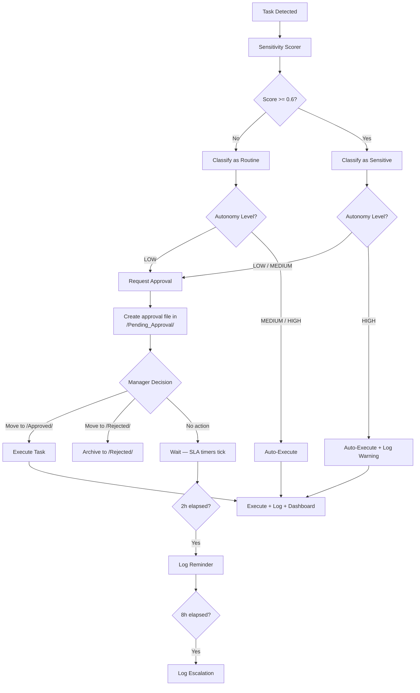

# Approval Workflow — Hakathone-0 (Digital FTE)

This document describes the complete approval routing logic, from sensitivity detection through approval resolution and execution.

---

## 1. Workflow Overview



## 2. Sensitivity Scoring Engine

The `sensitivity_scorer.py` module computes a risk score for each task using three mechanisms:

### 2.1 Weighted Keyword Matching

Each keyword has a weight between 0.0 and 1.0. All matching keywords contribute additively to the total score.

| Keyword | Weight | Category |
|---------|--------|----------|
| `password` | 1.0 | access_change |
| `credential` | 0.9 | access_change |
| `delete` | 0.9 | data_deletion |
| `payment` | 0.9 | financial |
| `invoice` | 0.8 | financial |
| `refund` | 0.8 | financial |
| `permission` | 0.7 | access_change |
| `email` | 0.6 | external_communication |
| `access` | 0.6 | access_change |
| `client` | 0.5 | external_communication |

### 2.2 Context Modifiers (Boosters)

Word pairs that appear together boost the score:

| Word Pair | Boost |
|-----------|-------|
| email + client | +0.3 |
| email + external | +0.2 |
| payment + invoice | +0.2 |
| delete + database | +0.3 |
| delete + production | +0.3 |
| access + admin | +0.3 |
| password + reset | +0.2 |
| credential + share | +0.3 |

### 2.3 Context Modifiers (Reducers)

Word pairs that indicate lower risk reduce the score:

| Word Pair | Reduction |
|-----------|-----------|
| email + internal | -0.2 |
| email + notification | -0.15 |
| delete + draft | -0.2 |
| delete + temp | -0.2 |
| access + read | -0.1 |

### 2.4 Score Computation

```
raw_score = sum(matched_keyword_weights) + sum(context_boosts) + sum(context_reductions)
final_score = clamp(raw_score, 0.0, 1.0)
requires_approval = final_score >= threshold (0.6)
```

### 2.5 Worked Examples

**Example 1: "Send an invoice to the client for $500 payment"**

| Match | Weight |
|-------|--------|
| invoice | +0.8 |
| client | +0.5 |
| payment | +0.9 |
| context(payment+invoice) | +0.2 |
| **Total (clamped)** | **1.0** |

Result: `score=1.0`, `category=financial`, `requires_approval=true`

**Example 2: "Prepare weekly internal report for the team"**

| Match | Weight |
|-------|--------|
| (none) | 0.0 |
| **Total** | **0.0** |

Result: `score=0.0`, `category=none`, `requires_approval=false`

**Example 3: "Email the client about the project update"**

| Match | Weight |
|-------|--------|
| email | +0.6 |
| client | +0.5 |
| context(email+client) | +0.3 |
| **Total (clamped)** | **1.0** |

Result: `score=1.0`, `category=external_communication`, `requires_approval=true`

## 3. Approval Request Generation

When a task requires approval, the system creates a structured file in `/Pending_Approval/`:

```yaml
---
task: <task_name>
priority: <P0-P3>
sensitivity_score: <0.0-1.0>
sensitivity_category: <category>
detected_at: <timestamp>
sla_deadline: <timestamp>
signals:
  - keyword (+weight)
  - context(word1+word2) (+modifier)
status: pending_approval
---

## Task Summary
<task description>

## Sensitivity Analysis
Score: X.XX (threshold: 0.60)
Category: <category>
Signals: <list>

## Recommended Action
<what the AI would do if approved>

## Approval Required
Move this file to /Approved/ to proceed, or /Rejected/ to deny.
```

## 4. Approval Resolution

### 4.1 Approve

1. Manager moves file from `/Pending_Approval/<task>.md` to `/Approved/<task>.md`
2. AI Employee detects the approved file
3. Task is executed according to the plan in `/Tasks/plan_<task>.md`
4. Result saved to `/Done/<task>.md`
5. Action logged with approval record

### 4.2 Reject

1. Manager moves file from `/Pending_Approval/<task>.md` to `/Rejected/<task>.md`
2. Task is not executed
3. Rejection logged

### 4.3 No Action (Timeout)

1. File remains in `/Pending_Approval/`
2. At 2 hours: reminder logged (log entry only — no notification sent)
3. At 8 hours: escalation logged (log entry only — no notification sent)
4. SLA deadline continues to tick; breach will be recorded if deadline passes

## 5. Approval Audit Trail

Every approval-related action is recorded in `/Logs/YYYY-MM-DD.md`:

```
- 18:28 - Approval Granted: Gmail_Inbox-event-224933
  - Task: Respond to partner email — Monday meeting agenda
  - Priority: P2
  - Sensitivity: external_communication (score: 0.6)
  - Approved by manager
  - Moved to /Approved and /Done
```

The weekly audit aggregates approval stats:

| Metric | Tracked |
|--------|---------|
| Approvals requested | Count per period |
| Approvals granted | Count per period |
| Approvals rejected | Count per period |
| Approval wait time | Logged per task |

## 6. Approval Routing Summary Table

| Autonomy | Routine (score < 0.6) | Sensitive (score >= 0.6) |
|----------|----------------------|--------------------------|
| LOW | Approval required | Approval required |
| **MEDIUM** (active) | **Auto-execute** | **Approval required** |
| HIGH | Auto-execute | Auto-execute (warning logged) |

## 7. Limitations

| Limitation | Detail |
|------------|--------|
| No notification to approver | Approval requests are files only; no Slack/email/push alert |
| No in-app approval UI | Approval requires manual file moves on the filesystem |
| Single-approver only | No multi-level chains or backup approvers |
| No identity verification | Any filesystem user can approve; no authentication |
| No cryptographic signing | Approvals are file moves, not signed actions |
| Escalations are log-only | Nobody is actually notified on escalation |
| No auto-escalation to backup | If primary approver is unavailable, task waits indefinitely |

---

*Generated by AI Employee (Digital FTE) on 2026-02-15 | Silver Tier*
