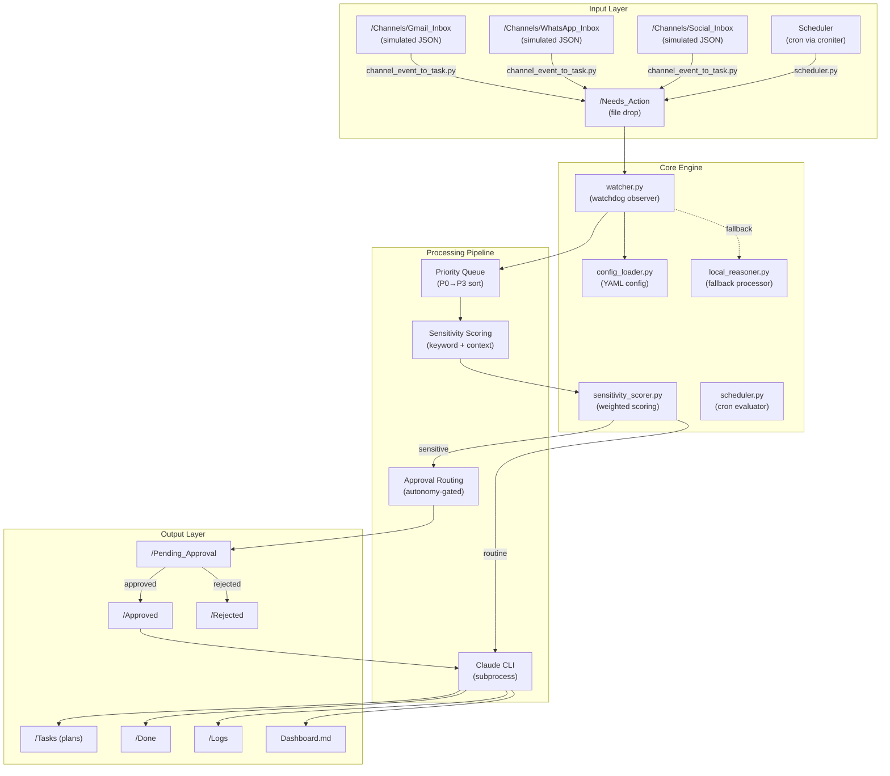
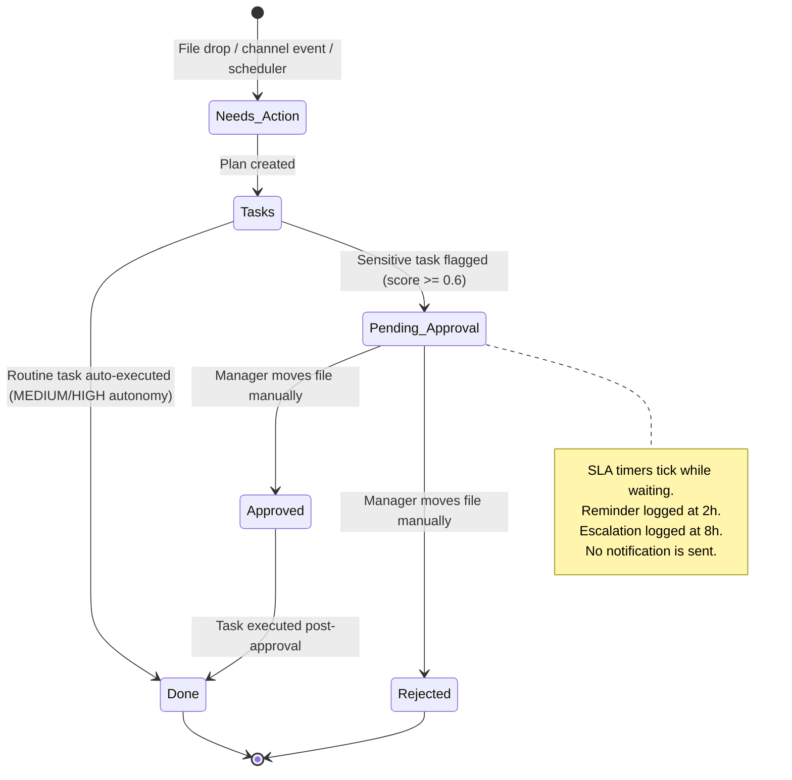
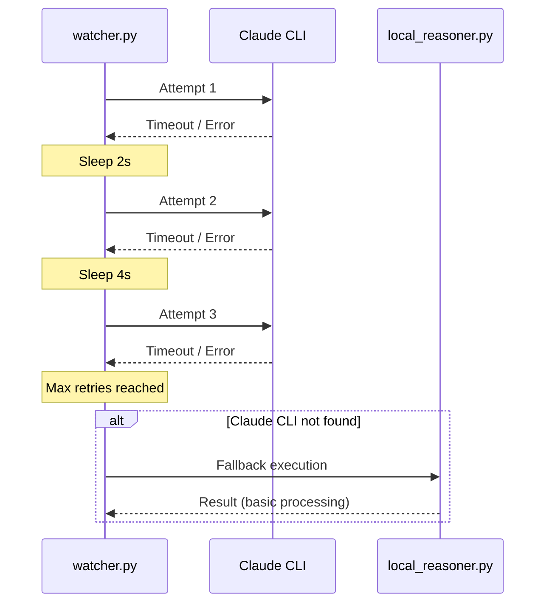

# Architecture — Hakathone-0 (Digital FTE)

This document describes the system architecture of the AI Employee Vault at the Silver Tier. All components described here are implemented and operational as of 2026-02-16.

> **Disclaimer:** All external API integrations (Gmail, WhatsApp, Social Media) are **simulated**. No real network calls are made. Channel watchers poll local JSON files only.

---

## 1. High-Level Architecture



## 2. Component Inventory

| Component | File | Role | Dependencies |
|-----------|------|------|-------------|
| File Watcher | `watcher.py` | Monitors `/Needs_Action` via `watchdog`; triggers processing pipeline | watchdog, config_loader, scheduler |
| Config Loader | `config_loader.py` | Reads `config.yaml`; provides paths, SLA deadlines, priority keywords, logging | PyYAML |
| Sensitivity Scorer | `sensitivity_scorer.py` | Weighted keyword scoring with context boosters/reducers; classifies sensitivity | config_loader |
| Scheduler | `scheduler.py` | Evaluates cron expressions via `croniter`; creates recurring task files | croniter, config_loader |
| Channel Converter | `channel_event_to_task.py` | Converts JSON events from `/Channels/` subdirectories into `.md` task files | config_loader |
| Local Reasoner | `local_reasoner.py` | Fallback processor when Claude CLI is unavailable | config_loader |
| Process Manager | `process_manager.py` | Auto-restarts `watcher.py` with exponential backoff on crash | subprocess |
| Dashboard Updater | `update_dashboard.py` | Regenerates `Dashboard.md` from folder state and log files | config_loader |
| Weekly Audit | `weekly_audit.py` | Aggregates daily logs into weekly summary and CEO briefing | config_loader |
| Gmail Watcher | `gmail_watcher.py` | Polls `/Channels/Gmail_Inbox/*.json` (simulated — no real API) | channel_event_to_task |
| WhatsApp Watcher | `whatsapp_watcher.py` | Polls `/Channels/WhatsApp_Inbox/*.json` (simulated — no real API) | channel_event_to_task |
| Social Watcher | `social_watcher.py` | Polls `/Channels/Social_Inbox/*.json` (simulated — no real API) | channel_event_to_task |

## 3. Folder Structure

```
AI_Employee_Vault/
├── config.yaml              # Single source of truth for all settings
├── watcher.py               # Core file watcher (watchdog)
├── sensitivity_scorer.py    # Weighted sensitivity scoring engine
├── scheduler.py             # Cron-based task scheduler (croniter)
├── config_loader.py         # Config reader + path helpers + logging
├── local_reasoner.py        # Offline fallback processor
├── process_manager.py       # Watcher lifecycle manager (auto-restart)
├── update_dashboard.py      # Dashboard regeneration script
├── weekly_audit.py          # Weekly audit + CEO briefing generator
├── channel_event_to_task.py # JSON-to-task converter
├── gmail_watcher.py         # Simulated Gmail poller
├── whatsapp_watcher.py      # Simulated WhatsApp poller
├── social_watcher.py        # Simulated social media poller
├── scheduler_state.json     # Persistent last-run timestamps for scheduler
├── SKILL.md                 # Agent procedural instructions
├── Company_Handbook.md      # Governance rules and policies
├── Business_Goals.md        # Organizational context
├── Dashboard.md             # Live status dashboard (regenerated)
├── Weekly_Audit.md          # Latest weekly report
├── CEO_Briefing.md          # Executive summary
│
├── Needs_Action/            # Inbox — new tasks land here
├── Tasks/                   # Plans created per task (plan_<name>.md)
├── Pending_Approval/        # Sensitive tasks awaiting human approval
├── Approved/                # Approved task records
├── Rejected/                # Rejected task records
├── Done/                    # Completed task outputs
├── Logs/                    # Daily action logs (YYYY-MM-DD.md)
├── Channels/                # Simulated external inputs
│   ├── Gmail_Inbox/         # Static JSON email events
│   ├── WhatsApp_Inbox/      # Static JSON message events
│   └── Social_Inbox/        # Static JSON social events
├── Docs/                    # System documentation (this folder)
├── Notes/                   # Freeform notes
└── Plans/                   # Strategic plans
```

## 4. Data Flow

### 4.1 Task Lifecycle



### 4.2 Processing Pipeline (Sequential)

1. **Detection** — `watcher.py` `on_created` event fires, or startup scan sorts existing files by priority
2. **Priority Assignment** — YAML frontmatter `priority:` field parsed; fallback to keyword auto-detection; fallback to default P2
3. **Priority Sorting** — On startup, existing `/Needs_Action/` files are sorted P0-first before sequential processing
4. **SLA Calculation** — `sla_deadline = detected_at + sla_hours(priority)` stored in task frontmatter
5. **Sensitivity Scoring** — `sensitivity_scorer.py` computes weighted score with context boosters and reducers
6. **Routing Decision** — Autonomy level (LOW/MEDIUM/HIGH) combined with sensitivity score determines auto-execute vs. approval
7. **Execution** — Claude CLI subprocess (120s timeout, 3 retries with exponential backoff) or `local_reasoner.py` fallback
8. **Logging** — `log_event()` writes to `/Logs/YYYY-MM-DD.md`
9. **Dashboard Update** — `update_dashboard.py` regenerates `Dashboard.md`

### 4.3 Scheduler Cycle

Every 60 poll iterations (~60 seconds at default 1s interval):

1. `scheduler.py` checks `config.yaml` cron expressions against `scheduler_state.json` last-run timestamps
2. Due tasks create `.md` files in `/Needs_Action/` with configured priority
3. `scheduler_state.json` is updated with new last-run time
4. `check_approval_reminders()` scans `/Pending_Approval/` and logs SLA warnings

## 5. Technology Stack

| Layer | Technology | Version |
|-------|-----------|---------|
| Language | Python | 3.11 |
| File Monitoring | `watchdog` | Observer pattern |
| Scheduling | `croniter` | Cron expression parser |
| AI Processing | Claude CLI | Subprocess invocation |
| Configuration | YAML | `config.yaml` via PyYAML |
| State Storage | Flat files | Markdown (.md) + JSON (.json) |
| Version Control | Git | All vault files tracked |
| Platform | Single-machine | Local filesystem only |

## 6. Integration Model

> **All external API integrations are simulated.** No network calls are made to Gmail, WhatsApp, or social media platforms. Channel watchers poll local JSON files only.

| Channel | Watcher File | Source | Reality |
|---------|-------------|--------|---------|
| Gmail | `gmail_watcher.py` | `/Channels/Gmail_Inbox/*.json` | **Simulated** — no OAuth, no IMAP, no Gmail API |
| WhatsApp | `whatsapp_watcher.py` | `/Channels/WhatsApp_Inbox/*.json` | **Simulated** — no Business API, no webhook |
| Social Media | `social_watcher.py` | `/Channels/Social_Inbox/*.json` | **Simulated** — no Twitter/LinkedIn/Instagram API |
| Notifications | Log entries only | `/Logs/YYYY-MM-DD.md` | **No delivery** — no Slack, email, SMS, or push |
| Calendar | Not implemented | — | **Not available** |
| CRM | Not implemented | — | **Not available** |
| Payments | Not implemented | — | **Not available** |

## 7. Resilience Model

| Mechanism | Implementation | Configuration |
|-----------|---------------|---------------|
| Retry with exponential backoff | `watcher.py` retry loop | `retry.max_attempts: 3`, `retry.initial_backoff: 2`, `retry.max_backoff: 60` |
| Task timeout | `subprocess.run(timeout=...)` | `watcher.timeout: 120` seconds |
| Fallback processor | `local_reasoner.py` activates on `FileNotFoundError` (Claude CLI not found) | Automatic |
| Process auto-restart | `process_manager.py` restarts `watcher.py` on crash with exponential backoff | Automatic |

### Retry Sequence



## 8. Automation Level

| Aspect | Silver Tier Capability |
|--------|----------------------|
| Task detection | **Automatic** — `watchdog` observer fires on file creation in `/Needs_Action/` |
| Priority assignment | **Automatic** — frontmatter parsing + keyword detection + configurable default |
| SLA tracking | **Automatic** — deadline calculated at detection, stored in frontmatter |
| Sensitivity scoring | **Automatic** — weighted keyword + context modifier scoring |
| Routine task execution | **Automatic** — at MEDIUM autonomy, routine tasks auto-execute without human intervention |
| Sensitive task routing | **Automatic** — creates structured approval file in `/Pending_Approval/` |
| Approval resolution | **Manual** — human must move files between folders on the filesystem |
| Notifications/alerts | **None** — all reminders and escalations are log entries only |
| Scheduling | **Automatic** — cron-based recurring task creation via `croniter` |
| Dashboard updates | **Automatic** — regenerated after each task completion |
| Weekly audit | **On-demand** — `weekly_audit.py` run manually or via scheduler |

## 9. Constraints

- **Single-threaded** — Tasks are processed sequentially; no concurrent execution
- **No database** — All state is flat files (Markdown + JSON); no transactions, no rollback
- **No authentication** — Filesystem access equals full control; no login system
- **No network dependencies** — Operates entirely on local filesystem (except Claude CLI subprocess calls)
- **Text-output only** — Produces markdown deliverables; cannot send emails, make API calls, modify databases, or deploy code
- **No version control on individual tasks** — Task files can be overwritten; only git tracks the vault at the repository level
- **No health check endpoint** — No way for external systems to verify the watcher is running

---

*Generated by AI Employee (Digital FTE) on 2026-02-16 | Silver Tier v2.0*
