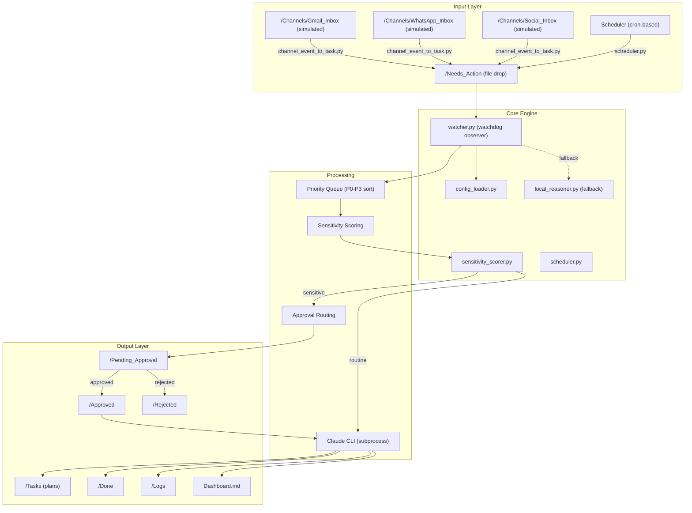
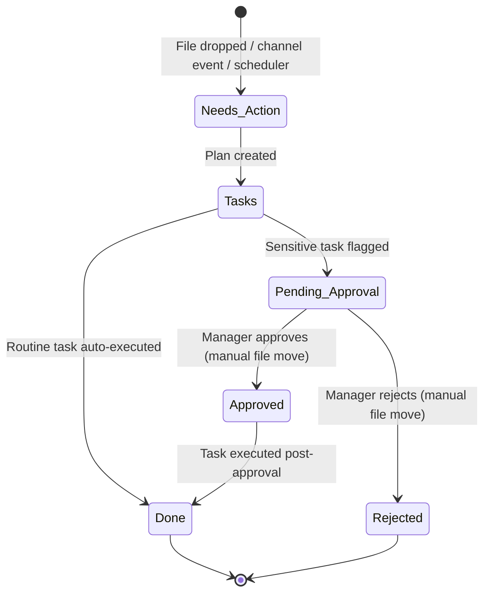

# Architecture — Hakathone-0 (Digital FTE)

This document describes the system architecture of the AI Employee Vault at the Silver Tier. All components described here are implemented and operational as of 2026-02-15.

---

## 1. High-Level Architecture



## 2. Component Inventory

| Component | File | Role |
|-----------|------|------|
| File Watcher | `watcher.py` | Monitors `/Needs_Action` using `watchdog` library; triggers processing pipeline |
| Config Loader | `config_loader.py` | Reads `config.yaml`; provides paths, SLA deadlines, priority keywords |
| Sensitivity Scorer | `sensitivity_scorer.py` | Weighted keyword scoring with context modifiers; classifies sensitivity |
| Scheduler | `scheduler.py` | Evaluates cron expressions via `croniter`; creates recurring task files |
| Channel Converter | `channel_event_to_task.py` | Converts JSON events from `/Channels/` into `.md` task files |
| Local Reasoner | `local_reasoner.py` | Fallback processor when Claude CLI is unavailable |
| Process Manager | `process_manager.py` | Auto-restarts watcher with exponential backoff on crash |
| Dashboard Updater | `update_dashboard.py` | Regenerates `Dashboard.md` from folder state and logs |
| Weekly Audit | `weekly_audit.py` | Aggregates logs into weekly summary and CEO briefing |
| Channel Watchers | `gmail_watcher.py`, `whatsapp_watcher.py`, `social_watcher.py` | Poll local JSON files in `/Channels/` subdirectories |

## 3. Folder Structure

```
AI_Employee_Vault/
├── config.yaml              # Single source of truth for all settings
├── watcher.py               # Core file watcher
├── sensitivity_scorer.py    # Sensitivity scoring engine
├── scheduler.py             # Cron-based task scheduler
├── config_loader.py         # Config reader + helpers
├── local_reasoner.py        # Offline fallback processor
├── process_manager.py       # Watcher lifecycle manager
├── update_dashboard.py      # Dashboard regeneration
├── weekly_audit.py          # Audit report generator
├── channel_event_to_task.py # JSON-to-task converter
├── gmail_watcher.py         # Simulated Gmail poller
├── whatsapp_watcher.py      # Simulated WhatsApp poller
├── social_watcher.py        # Simulated social media poller
├── SKILL.md                 # Agent procedural instructions
├── Company_Handbook.md      # Governance rules
├── Business_Goals.md        # Organizational context
├── Dashboard.md             # Live status dashboard
├── Weekly_Audit.md          # Latest weekly report
├── CEO_Briefing.md          # Executive summary
│
├── Needs_Action/            # Inbox — new tasks land here
├── Tasks/                   # Plans created per task
├── Pending_Approval/        # Sensitive tasks awaiting approval
├── Approved/                # Approved task records
├── Rejected/                # Rejected task records
├── Done/                    # Completed task outputs
├── Logs/                    # Daily action logs (YYYY-MM-DD.md)
├── Channels/                # Simulated external inputs
│   ├── Gmail_Inbox/         # Static JSON email events
│   ├── WhatsApp_Inbox/      # Static JSON message events
│   └── Social_Inbox/        # Static JSON social events
├── Docs/                    # System documentation
├── Notes/                   # Freeform notes
└── Plans/                   # Strategic plans
```

## 4. Data Flow

### 4.1 Task Lifecycle



### 4.2 Processing Pipeline

1. **Detection** — `watcher.py` (watchdog `on_created` event) or startup scan of existing files
2. **Priority Assignment** — Frontmatter `priority:` field parsed, or keyword auto-detection from body text
3. **Priority Sorting** — Existing tasks sorted P0-first before sequential processing
4. **SLA Calculation** — Deadline computed from priority level + detection timestamp
5. **Sensitivity Scoring** — `sensitivity_scorer.py` computes weighted score with context modifiers
6. **Routing Decision** — Based on autonomy level and sensitivity score vs. threshold
7. **Execution** — Claude CLI subprocess or local reasoner fallback
8. **Logging** — Action logged to `/Logs/YYYY-MM-DD.md`
9. **Dashboard Update** — `update_dashboard.py` regenerates `Dashboard.md`

## 5. Technology Stack

| Layer | Technology |
|-------|-----------|
| Language | Python 3.11 |
| File Monitoring | `watchdog` library |
| Scheduling | `croniter` library |
| AI Processing | Claude CLI (subprocess call) |
| Configuration | YAML (`config.yaml`) |
| State Storage | Flat files (Markdown + JSON) |
| Version Control | Git |
| Platform | Single-machine, local filesystem |

## 6. Integration Model

> **All external API integrations are simulated.** No network calls are made to Gmail, WhatsApp, or social media platforms. Channel watchers poll local JSON files only.

| Channel | Implementation | Reality |
|---------|---------------|---------|
| Gmail | `gmail_watcher.py` polls `/Channels/Gmail_Inbox/*.json` | **Simulated** — no OAuth, no IMAP |
| WhatsApp | `whatsapp_watcher.py` polls `/Channels/WhatsApp_Inbox/*.json` | **Simulated** — no Business API |
| Social | `social_watcher.py` polls `/Channels/Social_Inbox/*.json` | **Simulated** — no platform APIs |
| Notifications | Log entries only | **No delivery** — no Slack, email, or push |

## 7. Resilience Model

| Mechanism | Implementation |
|-----------|---------------|
| Retry with backoff | Max 3 attempts, 2s initial backoff, 60s max (exponential) |
| Task timeout | 120s per Claude CLI invocation |
| Fallback processor | `local_reasoner.py` activates if Claude CLI not found |
| Process auto-restart | `process_manager.py` restarts watcher on crash with backoff |

## 8. Constraints

- **Single-threaded** — Tasks processed sequentially; no concurrent execution
- **No database** — All state is flat files and JSON; no transactions or rollback
- **No authentication** — Filesystem access equals full control
- **No network dependencies** — Operates entirely on local filesystem (except Claude CLI calls)
- **Text-output only** — Produces markdown deliverables; cannot execute real-world actions

---

*Generated by AI Employee (Digital FTE) on 2026-02-15 | Silver Tier*
