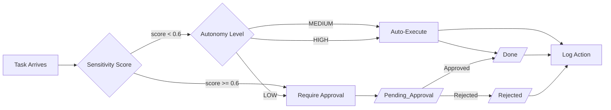
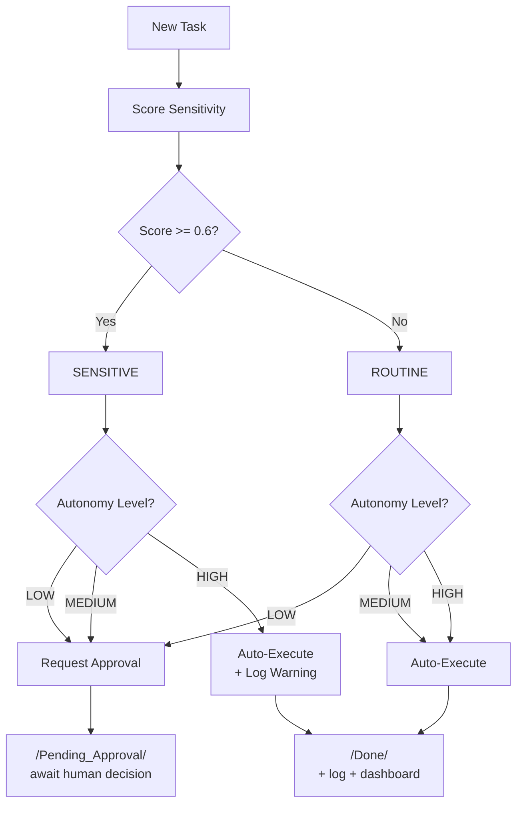
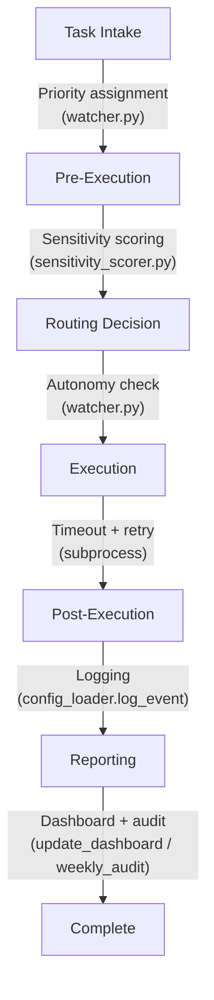

# Governance Model — Hakathone-0 (Digital FTE)

This document defines the governance framework that controls what the AI Employee can and cannot do autonomously. All governance is enforced through configuration, sensitivity scoring, and folder-based approval workflows.

> **Disclaimer:** All external API integrations are **simulated**. The system produces markdown files only — it cannot send emails, make API calls, or execute real-world actions.

---

## 1. Governance Overview

The AI Employee operates under a **config-driven governance model** where every autonomous action is bounded by four pillars:

1. **Autonomy Level** — Controls whether tasks execute automatically or require approval
2. **Sensitivity Scoring** — Classifies task risk using weighted keywords and context modifiers
3. **Approval Routing** — Routes sensitive tasks to a human approver before execution
4. **Audit Logging** — Records every action for post-hoc review and accountability



## 2. Autonomy Model

The system supports three autonomy levels, configured via `autonomy_level` in `config.yaml`. The current setting is **MEDIUM**.

### 2.1 Autonomy Level Definitions

| Level | Routine Tasks (score < 0.6) | Sensitive Tasks (score >= 0.6) | Use Case |
|-------|----------------------------|-------------------------------|----------|
| **LOW** | Request approval for all | Request approval for all | Maximum oversight; every task reviewed by human |
| **MEDIUM** (active) | Auto-execute | Request approval | Balanced; routine work flows freely, sensitive flagged |
| **HIGH** | Auto-execute | Auto-execute (log warning) | Maximum throughput; all tasks processed without blocking |

### 2.2 Autonomy Decision Matrix



### 2.3 Autonomy Configuration

```yaml
# config.yaml
autonomy_level: MEDIUM  # LOW / MEDIUM / HIGH
```

Changing this value immediately affects all subsequent task processing. No restart is required — `config.yaml` is re-read on each task.

## 3. Sensitivity Classification

### 3.1 Scoring Engine

Tasks are scored by `sensitivity_scorer.py` using three mechanisms:

1. **Weighted keyword matching** — each keyword has a weight (0.0–1.0)
2. **Context boosters** — word pairs that increase risk score
3. **Context reducers** — word pairs that decrease risk score

Final score is clamped to [0.0, 1.0]. If `score >= threshold (0.6)`, the task is classified as **sensitive**.

### 3.2 Keyword Weights

| Keyword | Weight | Category |
|---------|--------|----------|
| `password` | 1.0 | `access_change` |
| `credential` | 0.9 | `access_change` |
| `delete` | 0.9 | `data_deletion` |
| `payment` | 0.9 | `financial` |
| `invoice` | 0.8 | `financial` |
| `refund` | 0.8 | `financial` |
| `permission` | 0.7 | `access_change` |
| `email` | 0.6 | `external_communication` |
| `access` | 0.6 | `access_change` |
| `client` | 0.5 | `external_communication` |

### 3.3 Context Boosters

| Word Pair | Score Boost | Rationale |
|-----------|------------|-----------|
| email + client | +0.3 | External communication to specific recipient |
| email + external | +0.2 | Outbound communication |
| payment + invoice | +0.2 | Financial transaction |
| delete + database | +0.3 | Destructive data operation |
| delete + production | +0.3 | Production environment risk |
| access + admin | +0.3 | Privileged access change |
| password + reset | +0.2 | Credential modification |
| credential + share | +0.3 | Credential exposure risk |

### 3.4 Context Reducers

| Word Pair | Score Reduction | Rationale |
|-----------|----------------|-----------|
| email + internal | -0.2 | Internal-only communication |
| email + notification | -0.15 | System notification, not personal |
| delete + draft | -0.2 | Removing draft, not live data |
| delete + temp | -0.2 | Temporary file cleanup |
| access + read | -0.1 | Read-only access, not write |

### 3.5 Sensitivity Categories

| Category | Trigger Keywords | Example Tasks |
|----------|-----------------|---------------|
| `financial` | invoice, payment, refund | Process invoice, issue refund |
| `external_communication` | email, client | Send client email, respond to partner |
| `data_deletion` | delete | Delete user records, purge logs |
| `access_change` | password, credential, permission, access | Reset password, modify permissions |
| `none` | (no keyword matches) | Internal report, research task |

The category with the highest cumulative keyword weight determines the task's classification.

### 3.6 Scoring Formula

```
raw_score = Σ(matched_keyword_weights) + Σ(context_boosts) + Σ(context_reductions)
final_score = clamp(raw_score, 0.0, 1.0)
requires_approval = (final_score >= 0.6) AND (autonomy_level != HIGH)
```

## 4. Approval Authority

| Role | Mechanism | Authority |
|------|-----------|-----------|
| Manager / CEO | Manual file move from `/Pending_Approval/` to `/Approved/` or `/Rejected/` | Sole approval authority |
| AI Employee | Creates structured approval request files; cannot self-approve | Execution authority (post-approval only) |

### Current Limitations of Approval Governance

| Limitation | Impact |
|------------|--------|
| No notification to approver | Approvers must manually check `/Pending_Approval/` |
| No identity verification | Anyone with filesystem access can approve/reject |
| No multi-level approval | Single approver only; no chains or escalation to backup |
| No cryptographic signatures | Approval is a file move, not a signed action |
| No approval UI | No web form, Slack button, or email link — just file operations |

## 5. Guardrails and Constraints

### 5.1 Hard Constraints (cannot be overridden)

| Constraint | Enforcement |
|------------|-------------|
| Text-output only | System produces markdown files; cannot send emails, make API calls, modify external systems, or deploy code |
| Sequential processing | One task at a time; no parallel execution; P0 arriving during P3 must wait |
| No self-modification | AI Employee cannot modify its own config, scripts, or governance rules during task execution |
| Audit trail mandatory | Every action is logged to `/Logs/YYYY-MM-DD.md`; no silent operations |
| All APIs simulated | No real network calls to Gmail, WhatsApp, or social platforms |

### 5.2 Soft Constraints (configurable via `config.yaml`)

| Constraint | Config Key | Default | Range |
|------------|-----------|---------|-------|
| Autonomy level | `autonomy_level` | MEDIUM | LOW / MEDIUM / HIGH |
| Sensitivity threshold | `sensitivity.threshold` | 0.6 | 0.0–1.0 |
| Keyword weights | `sensitivity.keywords_weighted` | See §3.2 | 0.0–1.0 per keyword |
| SLA deadlines | `priority.P0–P3.sla_hours` | 1 / 4 / 24 / 72 | Any positive integer |
| Retry attempts | `retry.max_attempts` | 3 | Any positive integer |
| Task timeout | `watcher.timeout` | 120s | Any positive integer |
| Reminder threshold | `sla.reminder_after_hours` | 2 | Any positive number |
| Escalation threshold | `sla.escalation_after_hours` | 8 | Any positive number |

## 6. Governance Enforcement Points



| Stage | Check | Enforced By |
|-------|-------|-------------|
| Task intake | Priority assignment (frontmatter → keywords → default) | `watcher.py` |
| Pre-execution | Sensitivity scoring (weighted keywords + context) | `sensitivity_scorer.py` |
| Pre-execution | Approval routing (autonomy level vs. sensitivity) | `watcher.py` |
| Execution | Timeout enforcement (120s per Claude CLI call) | `subprocess.run(timeout=...)` |
| Execution | Retry limits (max 3 attempts, exponential backoff) | `watcher.py` retry loop |
| Post-execution | Action logging (every state transition) | `config_loader.log_event()` |
| Post-execution | Dashboard update (folder counts, SLA %, activity) | `update_dashboard.py` |
| Weekly | Audit report (aggregated metrics, compliance) | `weekly_audit.py` |

## 7. Risk Mitigation Summary

| Risk | Mitigation | Residual Risk |
|------|-----------|---------------|
| Unauthorized sensitive action | Sensitivity scoring + approval routing at MEDIUM autonomy | Keywords are static; novel sensitive phrases may not trigger scoring |
| Runaway execution | 120s timeout + 3 retry max + exponential backoff (2s→4s→8s, capped at 60s) | A single long-running task blocks all other processing |
| Watcher crash | Process manager with auto-restart and exponential backoff | Process manager itself is not supervised |
| Claude CLI unavailable | Local reasoner fallback provides basic task processing | Local reasoner has limited capability compared to Claude |
| Audit gap | Mandatory `log_event()` on every action; weekly audit aggregation | Logs are mutable flat files; no integrity protection |
| Config drift | Single `config.yaml` as source of truth; re-read on each task | No config validation or schema enforcement |
| Unauthorized approval | Filesystem-based approval requires folder access | No authentication; anyone with file access can approve |

---

*Generated by AI Employee (Digital FTE) on 2026-02-16 | Silver Tier v2.0*
