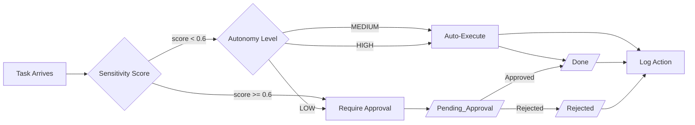
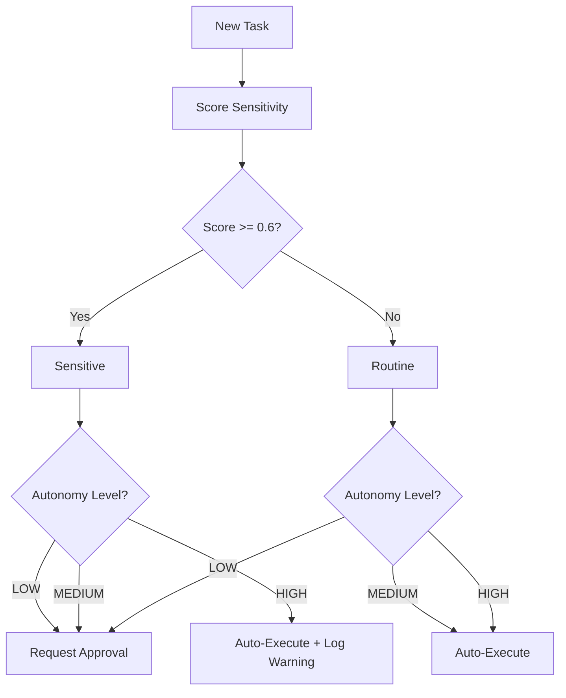

# Governance Model — Hakathone-0 (Digital FTE)

This document defines the governance framework that controls what the AI Employee can and cannot do autonomously. All governance is enforced through configuration, sensitivity scoring, and folder-based approval workflows.

---

## 1. Governance Overview

The AI Employee operates under a **config-driven governance model** where every autonomous action is bounded by:

1. **Autonomy level** — Controls whether tasks execute automatically or require approval
2. **Sensitivity scoring** — Classifies task risk using weighted keywords and context
3. **Approval routing** — Routes sensitive tasks to a human approver before execution
4. **Audit logging** — Records every action for post-hoc review

## 2. Autonomy Model

The system supports three autonomy levels, configured via `autonomy_level` in `config.yaml`.

| Level | Routine Tasks (score < threshold) | Sensitive Tasks (score >= threshold) | Use Case |
|-------|-----------------------------------|--------------------------------------|----------|
| **LOW** | Request approval | Request approval | Maximum oversight; all tasks reviewed |
| **MEDIUM** (current) | Auto-execute | Request approval | Balanced; routine work flows, sensitive flagged |
| **HIGH** | Auto-execute | Auto-execute (log warning) | Maximum throughput; all tasks auto-processed |

**Current setting:** `MEDIUM`

### Autonomy Decision Matrix

## 3. Sensitivity Classification

Tasks are classified by the `sensitivity_scorer.py` engine into four categories:

| Category | Trigger Keywords | Example Tasks |
|----------|-----------------|---------------|
| `financial` | invoice (0.8), payment (0.9), refund (0.8) | Process invoice, issue refund |
| `external_communication` | email (0.6), client (0.5) | Send client email, respond to partner |
| `data_deletion` | delete (0.9) | Delete user records, purge logs |
| `access_change` | password (1.0), credential (0.9), permission (0.7), access (0.6) | Reset password, modify permissions |

The top category by cumulative score determines the task's classification. Tasks with no keyword matches are classified as `none` (routine).

## 4. Approval Authority

| Role | Mechanism | Authority |
|------|-----------|-----------|
| Manager / CEO | Manual file move from `/Pending_Approval/` to `/Approved/` or `/Rejected/` | Sole approval authority |
| AI Employee | Creates approval request files; cannot self-approve | Execution authority (post-approval) |

### Limitations of Current Approval Governance

- **No notification** — Approvers must manually check `/Pending_Approval/`
- **No identity verification** — Anyone with filesystem access can approve/reject
- **No multi-level approval** — Single approver only; no chains or escalation to backup
- **No cryptographic signatures** — Approval is a file move, not a signed action

## 5. Guardrails and Constraints

### 5.1 Hard Constraints (cannot be overridden by config)

| Constraint | Enforcement |
|------------|-------------|
| Text-output only | System produces markdown files; cannot send emails, make API calls, or modify external systems |
| Sequential processing | One task at a time; no parallel execution |
| No self-modification | AI Employee cannot modify its own config, scripts, or governance rules during execution |
| Audit trail mandatory | Every action is logged to `/Logs/`; no silent operations |

### 5.2 Soft Constraints (configurable via `config.yaml`)

| Constraint | Config Key | Default |
|------------|-----------|---------|
| Autonomy level | `autonomy_level` | MEDIUM |
| Sensitivity threshold | `sensitivity.threshold` | 0.6 |
| Keyword weights | `sensitivity.keywords_weighted` | See config.yaml |
| SLA deadlines | `priority.P0-P3.sla_hours` | 1h / 4h / 24h / 72h |
| Retry attempts | `retry.max_attempts` | 3 |
| Task timeout | `watcher.timeout` | 120s |

## 6. Governance Enforcement Points

| Stage | Check | Enforced By |
|-------|-------|-------------|
| Task intake | Priority assignment | `watcher.py` reads frontmatter + keyword detection |
| Pre-execution | Sensitivity scoring | `sensitivity_scorer.py` evaluates weighted score |
| Pre-execution | Approval routing | `watcher.py` checks autonomy level vs. sensitivity |
| Execution | Timeout enforcement | subprocess timeout (120s default) |
| Execution | Retry limits | Max 3 attempts with exponential backoff |
| Post-execution | Logging | `config_loader.log_event()` writes to daily log |
| Post-execution | Dashboard update | `update_dashboard.py` reflects current state |
| Weekly | Audit report | `weekly_audit.py` aggregates and summarizes |

## 7. Risk Mitigation Summary

| Risk | Mitigation |
|------|-----------|
| Unauthorized sensitive action | Sensitivity scoring + approval routing at MEDIUM autonomy |
| Runaway execution | 120s timeout + 3 retry max + exponential backoff |
| Watcher crash | Process manager with auto-restart |
| Claude CLI unavailable | Local reasoner fallback |
| Audit gap | Mandatory logging on every action; weekly audit aggregation |
| Config drift | Single `config.yaml` as source of truth for all components |

---

*Generated by AI Employee (Digital FTE) on 2026-02-15 | Silver Tier*
