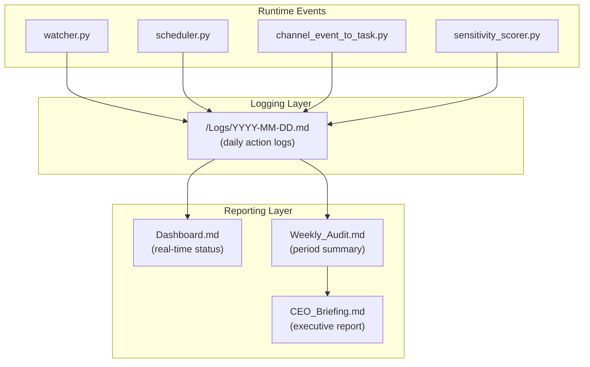

# Observability and Audit — Hakathone-0 (Digital FTE)

This document describes the logging, auditing, dashboarding, and observability mechanisms implemented at the Silver Tier.

---

## 1. Observability Stack Overview



## 2. Daily Action Logs

### 2.1 Format

Each day's log is written to `/Logs/YYYY-MM-DD.md` using the `log_event()` function from `config_loader.py`.

Entry format:
```markdown
- HH:MM - <Event Title>
  - <Detail line 1>
  - <Detail line 2>
```

### 2.2 Logged Events

| Event Type | Trigger | Details Recorded |
|------------|---------|-----------------|
| Watcher Started | `watcher.py` startup | Tier, autonomy level, poll interval |
| New Task Detected | File appears in `/Needs_Action/` | Filename, priority, SLA deadline, path |
| Task Processed | Claude CLI completes | Task name, priority, attempt count |
| Task Completed | Result moved to `/Done/` | Task name, sensitivity, approval status |
| Approval Requested | Sensitive task flagged | Task name, sensitivity category |
| Approval Granted | File moved to `/Approved/` | Task name, priority, sensitivity score |
| Approval Rejected | File moved to `/Rejected/` | Task name, reason |
| SLA Reminder | 2h approval wait | Approval name, hours waiting |
| SLA Escalation | 8h approval wait | Approval name, hours waiting |
| Scheduled Task Created | Cron expression triggers | Job name, priority, filename |
| Error: Timeout | Claude CLI exceeds 120s | Task name, attempt number |
| Error: Missing Claude CLI | `claude` not in PATH | Task name |
| Fallback Executed | Local reasoner runs | Task name |
| Watcher Stopped | Ctrl+C or crash | Reason |

### 2.3 Log Retention

Logs are retained indefinitely as flat files. There is no automatic rotation or cleanup. Git tracks all log files.

## 3. Dashboard

### 3.1 Location and Update Trigger

`Dashboard.md` is regenerated by `update_dashboard.py` after every task completion and on demand.

### 3.2 Dashboard Sections

| Section | Content |
|---------|---------|
| Status Bar | Tier, autonomy level, last active timestamp |
| Priority Distribution | Visual bar chart (P0-P3 counts) |
| SLA Performance | Compliance percentage (on-time / total) |
| Overdue Tasks | List of tasks past SLA deadline |
| Active Tasks | Currently processing tasks |
| Pending Approvals | Tasks awaiting manager decision |
| Completed Today | Tasks finished on current date |
| Recent Activity | Timestamped action log (latest entries) |
| Queue Summary | File counts per folder |
| Lifetime Stats | Cumulative metrics since vault creation |
| System Config | Current config values |

### 3.3 Key Metrics on Dashboard

| Metric | Calculation |
|--------|------------|
| SLA Compliance % | `on_time_completions / total_tasks_with_sla × 100` |
| Completion Rate % | `completed_tasks / total_tasks_received × 100` |
| Priority Distribution | Count of completed tasks per P-level |
| Sensitive Actions Flagged | Count of tasks with `sensitivity_score >= threshold` |
| Approvals Requested/Granted/Rejected | Lifetime counts from logs and folder state |

## 4. Weekly Audit

### 4.1 Generation

`weekly_audit.py` runs on demand (or via scheduler) and aggregates the past 7 days of logs.

### 4.2 Audit Report Structure

| Section | Content |
|---------|---------|
| Summary Table | Total actions, sensitive flags, approvals, errors, SLA events |
| SLA Compliance | Tasks tracked, on-time count, compliance rate |
| Priority Breakdown | Count per priority level for the period |
| Activity Log | Chronological list of all logged events |

### 4.3 Metrics Tracked

| Metric | Source |
|--------|--------|
| Total Actions | Count of all log entries |
| Sensitive Flags | Entries containing sensitivity/approval keywords |
| Approvals Requested | "Approval Requested" log events |
| Approvals Granted | "Approval Granted" log events |
| Approvals Rejected | "Approval Rejected" / rejection folder count |
| Routine Tasks | Tasks processed without approval |
| Errors | "Error:" prefixed log events |
| SLA Reminders | "SLA Reminder" log events |
| SLA Escalations | "SLA Escalation" log events |
| Scheduled Tasks | "Scheduled Task" log events |

## 5. CEO Briefing

### 5.1 Purpose

`CEO_Briefing.md` provides an executive-level summary suitable for non-technical stakeholders.

### 5.2 Sections

| Section | Content |
|---------|---------|
| Executive Summary | One-paragraph system status |
| Key Metrics | SLA compliance, completion rate, volume |
| Risk Items | SLA breaches, errors, pending approvals |
| Recommendations | Suggested actions based on audit findings |

## 6. Observability Gap Analysis

| Capability | Status | Detail |
|------------|--------|--------|
| Daily structured logs | **Implemented** | Markdown logs per day |
| Dashboard | **Implemented** | Static markdown, regenerated on events |
| Weekly audit | **Implemented** | Aggregated period summary |
| CEO briefing | **Implemented** | Executive report |
| Real-time monitoring UI | **Not implemented** | Dashboard is a file, not a live web page |
| Alerting system | **Not implemented** | No PagerDuty, OpsGenie, or similar |
| Metrics export | **Not implemented** | No Prometheus, Datadog, or telemetry |
| Health checks | **Not implemented** | No endpoint to verify system is running |
| Structured logging (JSON) | **Not implemented** | Logs are markdown, not machine-parseable |
| Distributed tracing | **Not implemented** | Single-process system; no trace IDs |
| Log search/query | **Not implemented** | Must grep files manually |

## 7. Audit Compliance Checklist

| Requirement | Met? | Evidence |
|-------------|------|----------|
| Every task action is logged | Yes | `log_event()` called on every state transition |
| Approval decisions are recorded | Yes | Log entries + file in `/Approved/` or `/Rejected/` |
| SLA deadlines are tracked | Yes | Stored in task frontmatter; reported in audit |
| Sensitivity scores are recorded | Yes | Stored in task frontmatter and approval files |
| Dashboard reflects current state | Yes | Regenerated after each task completion |
| Weekly summary is available | Yes | `Weekly_Audit.md` generated on demand |
| Executive report is available | Yes | `CEO_Briefing.md` generated with audit |
| Logs are version-controlled | Yes | Git tracks all files in the vault |
| Logs can be tampered with | Yes | No integrity protection; filesystem access = edit access |

---

*Generated by AI Employee (Digital FTE) on 2026-02-15 | Silver Tier*
