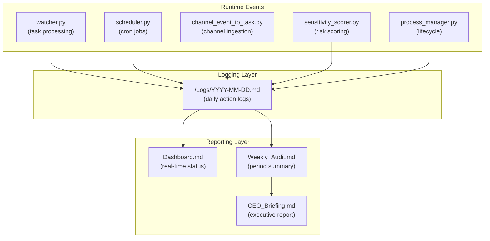
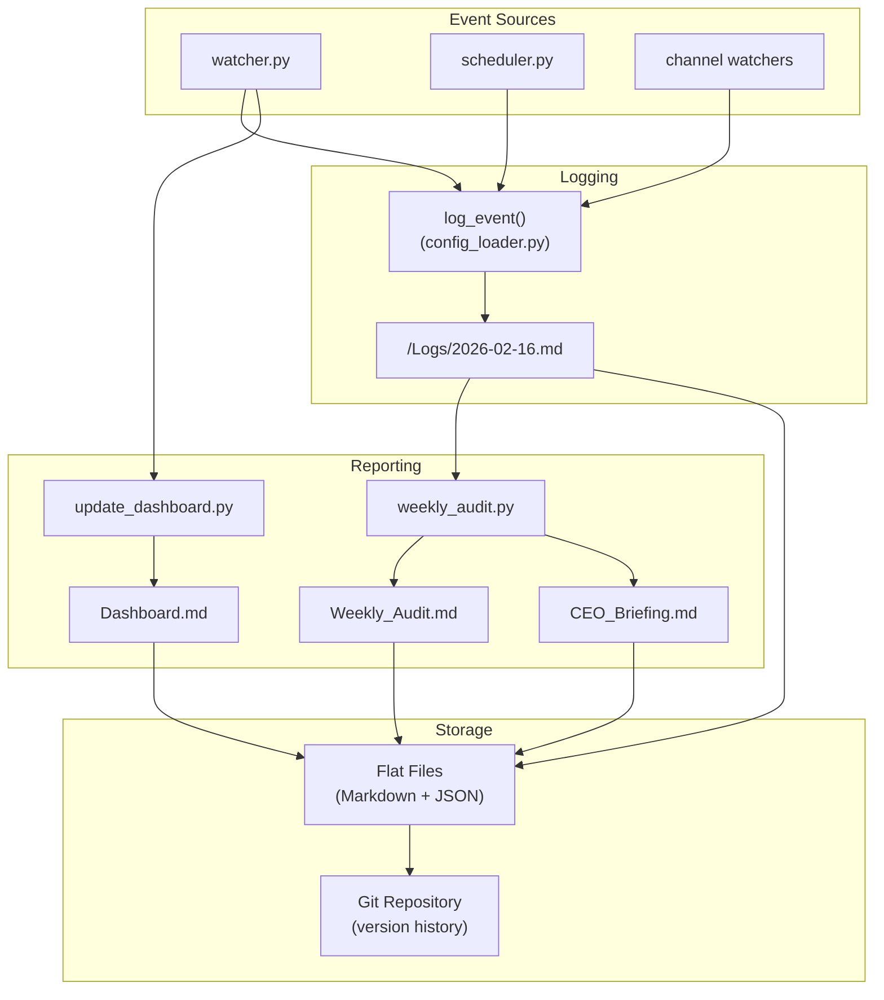

# Observability and Audit — Hakathone-0 (Digital FTE)

This document describes the logging, auditing, dashboarding, and observability mechanisms implemented at the Silver Tier.

> **Disclaimer:** All observability is file-based. There is no real-time monitoring UI, no alerting system, no metrics export, and no health check endpoint. All external APIs are simulated.

---

## 1. Observability Stack Overview



## 2. Daily Action Logs

### 2.1 Location and Format

Each day's log is written to `/Logs/YYYY-MM-DD.md` using the `log_event()` function from `config_loader.py`.

Entry format:
```markdown
- HH:MM - <Event Title>
  - <Detail line 1>
  - <Detail line 2>
  - <Detail line N>
```

### 2.2 Logged Event Types

| Event Type | Trigger | Details Recorded |
|------------|---------|-----------------|
| Watcher Started | `watcher.py` startup | Tier, autonomy level, poll interval |
| New Task Detected | File appears in `/Needs_Action/` | Filename, priority, SLA deadline, file path |
| Task Processed | Claude CLI completes successfully | Task name, priority, attempt count |
| Task Completed | Result moved to `/Done/` | Task name, sensitivity status, approval status |
| Approval Requested | Sensitive task flagged | Task name, sensitivity category, score |
| Approval Granted | File moved to `/Approved/` | Task name, priority, sensitivity score, category |
| Approval Rejected | File moved to `/Rejected/` | Task name, reason |
| SLA Reminder | 2h approval wait exceeded | Approval name, hours waiting |
| SLA Escalation | 8h approval wait exceeded | Approval name, hours waiting |
| Scheduled Task Created | Cron expression triggers | Job name, priority, filename |
| Error: Timeout | Claude CLI exceeds 120s timeout | Task name, attempt number |
| Error: Missing Claude CLI | `claude` command not in PATH | Task name |
| Fallback Executed | Local reasoner processes task | Task name |
| Watcher Stopped | Ctrl+C or crash | Reason (KeyboardInterrupt, exception) |
| Scheduler Error | Cron evaluation fails | Error message |
| Approval Monitor Error | Approval check fails | Error message |

### 2.3 Log Retention

- Logs are retained **indefinitely** as flat markdown files
- No automatic rotation, compression, or cleanup
- Git tracks all log files in the vault repository
- No size limits enforced per log file

### 2.4 Log Integrity

| Aspect | Status |
|--------|--------|
| Append-only enforcement | **No** — files can be edited or deleted by anyone with filesystem access |
| Cryptographic hash chain | **No** — no integrity verification |
| Tamper detection | **No** — modifications leave no trace beyond git diff |
| Access logging | **No** — no record of who reads or edits logs |

## 3. Dashboard

### 3.1 Location and Update Trigger

`Dashboard.md` is located at the vault root and is regenerated by `update_dashboard.py`:

- **After every task completion** (called by `watcher.py`)
- **On demand** (run `python update_dashboard.py` manually)

### 3.2 Dashboard Sections

| Section | Content | Data Source |
|---------|---------|------------|
| Status Bar | Tier, autonomy level, last active timestamp | `config.yaml` + timestamp |
| Priority Distribution | Visual bar chart (P0–P3 counts) | `/Done/` frontmatter |
| SLA Performance | Compliance percentage (on-time / total) | `/Done/` frontmatter timestamps |
| Overdue Tasks | List of tasks past SLA deadline | `/Needs_Action/` + `/Pending_Approval/` |
| Active Tasks | Currently processing tasks | `/Needs_Action/` |
| Pending Approvals | Tasks awaiting manager decision | `/Pending_Approval/` |
| Completed Today | Tasks finished on current date | `/Done/` frontmatter dates |
| Recent Activity | Timestamped action log (latest entries) | `/Logs/` latest file |
| Queue Summary | File counts per folder | Filesystem directory listing |
| Lifetime Stats | Cumulative metrics since vault creation | All logs + folder counts |
| System Config | Current config values | `config.yaml` |

### 3.3 Key Dashboard Metrics

| Metric | Calculation | Current Value |
|--------|------------|---------------|
| SLA Compliance % | `on_time / total_with_sla × 100` | 75% |
| Completion Rate % | `completed / total_received × 100` | 100% |
| Priority Distribution | Count per P-level in `/Done/` | P0:0, P1:6, P2:5, P3:1 |
| Sensitive Actions Flagged | Count where `score >= threshold` | 5 |
| Approvals Requested | Lifetime count from logs | 6 |
| Approvals Granted | Lifetime count from logs + `/Approved/` | 5 |
| Approvals Rejected | Lifetime count from `/Rejected/` | 0 |

### 3.4 Dashboard Limitations

- **Static markdown file** — not a live web page; must be re-opened to see updates
- **No auto-refresh** — requires manual file reload or next task completion
- **No filtering or search** — fixed format, cannot query or drill down
- **No charts** — uses ASCII bar visualization only (e.g., `████████ 5`)

## 4. Weekly Audit

### 4.1 Generation

`weekly_audit.py` runs on demand (or via scheduled job) and aggregates the past 7 days of daily logs.

Output files:
- `Weekly_Audit.md` — detailed audit report
- `CEO_Briefing.md` — executive summary

### 4.2 Audit Report Structure

| Section | Content |
|---------|---------|
| Summary Table | Total actions, sensitive flags, approvals, errors, SLA events |
| SLA Compliance | Tasks tracked, on-time count, compliance rate |
| Priority Breakdown | Count per priority level for the period |
| Activity Log | Chronological list of all logged events from the period |

### 4.3 Metrics Tracked in Weekly Audit

| Metric | Source | Detection Method |
|--------|--------|-----------------|
| Total Actions | All log entries | Count of `- HH:MM -` lines |
| Sensitive Flags | Sensitivity/approval log entries | Keyword match in log text |
| Approvals Requested | "Approval Requested" events | Log entry title match |
| Approvals Granted | "Approval Granted" events | Log entry title match |
| Approvals Rejected | "Approval Rejected" events + `/Rejected/` count | Log + folder |
| Routine Tasks | Tasks processed without approval | "Routine" keyword in log |
| Errors | Error log entries | "Error:" prefix match |
| SLA Reminders | SLA reminder events | "SLA Reminder" title match |
| SLA Escalations | SLA escalation events | "SLA Escalation" title match |
| Scheduled Tasks | Scheduler-created tasks | "Scheduled Task" title match |

### 4.4 Latest Audit Summary (2026-02-09 → 2026-02-15)

| Metric | Value |
|--------|-------|
| Total Actions | 56 |
| Sensitive Flags | 9 |
| Approvals Requested | 3 |
| Approvals Granted | 5 |
| Approvals Rejected | 1 |
| Routine Tasks | 7 |
| Errors | 7 |
| SLA Compliance | 75% (9/12 on-time) |

## 5. CEO Briefing

### 5.1 Purpose

`CEO_Briefing.md` provides an executive-level summary suitable for non-technical stakeholders. Generated alongside the weekly audit.

### 5.2 Sections

| Section | Content |
|---------|---------|
| Executive Summary | One-paragraph system status overview |
| Key Metrics | SLA compliance, completion rate, task volume |
| Risk Items | SLA breaches, errors, pending approvals |
| Recommendations | Suggested actions based on audit findings |

## 6. Observability Gap Analysis

| Capability | Implemented | Not Implemented |
|------------|------------|----------------|
| Daily structured logs | Markdown logs per day | JSON structured logs (machine-parseable) |
| Dashboard | Static markdown, regenerated on events | Live web UI with auto-refresh |
| Weekly audit | Aggregated period summary | Continuous monitoring |
| CEO briefing | Executive report | Automated delivery (email/Slack) |
| Alerting | — | PagerDuty, OpsGenie, or similar |
| Metrics export | — | Prometheus, Datadog, or telemetry |
| Health checks | — | HTTP endpoint for external monitoring |
| Distributed tracing | — | Trace IDs across components |
| Log search/query | — | Elasticsearch, Loki, or similar |
| Log integrity | Git history only | Cryptographic hash chain, append-only |

## 7. Audit Compliance Checklist

| Requirement | Met? | Evidence |
|-------------|------|----------|
| Every task action is logged | **Yes** | `log_event()` called on every state transition in `watcher.py` |
| Approval decisions are recorded | **Yes** | Log entries + files in `/Approved/` or `/Rejected/` |
| SLA deadlines are tracked | **Yes** | Stored in task frontmatter (`detected_at`, `sla_deadline`) |
| Sensitivity scores are recorded | **Yes** | Stored in approval request files and task frontmatter |
| Dashboard reflects current state | **Yes** | `update_dashboard.py` runs after each task completion |
| Weekly summary is available | **Yes** | `Weekly_Audit.md` generated on demand or via scheduler |
| Executive report is available | **Yes** | `CEO_Briefing.md` generated alongside weekly audit |
| Logs are version-controlled | **Yes** | Git tracks all files in the vault |
| Logs can be tampered with | **Yes** | No integrity protection; filesystem access = edit access |
| Notifications delivered to humans | **No** | All reminders/escalations are log entries only |
| Real-time monitoring available | **No** | Dashboard is a static file, not a live page |

## 8. Observability Architecture Diagram



---

*Generated by AI Employee (Digital FTE) on 2026-02-16 | Silver Tier v2.0*
