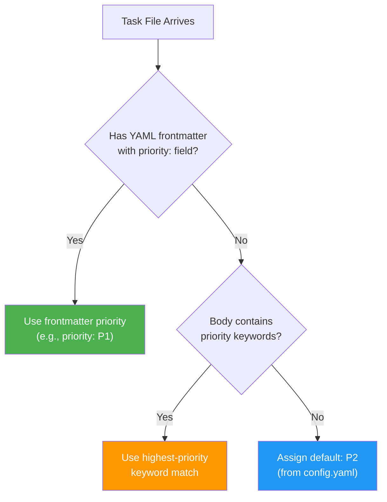
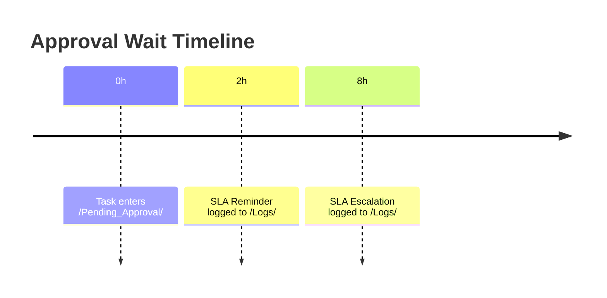

# SLA and Priority Model — Hakathone-0 (Digital FTE)

This document defines how tasks are prioritized, how SLA deadlines are computed and tracked, and how compliance is measured across the system.

> **Disclaimer:** SLA reminders and escalations are log entries only. No notifications are delivered to any human. All external APIs are simulated.

---

## 1. Priority Levels

The system uses a 4-level priority scheme (P0–P3), defined in `config.yaml`:

| Priority | Label | SLA Window | Description | Example |
|----------|-------|-----------|-------------|---------|
| **P0** | Critical | 1 hour | System-down, data-loss, urgent executive requests | Production outage, security breach |
| **P1** | High | 4 hours | Time-sensitive business tasks, client-facing deadlines | Client proposal due today, urgent reply |
| **P2** | Medium | 24 hours | Standard work items, reports, routine requests | Weekly report, content strategy |
| **P3** | Low | 72 hours | Backlog items, internal improvements, non-urgent | Internal research, documentation |

**Default priority:** P2 (Medium) — assigned when no priority is specified or detected.

## 2. Priority Assignment

Priority is determined through a three-step fallback chain:



### 2.1 Frontmatter Detection

If the task file contains YAML frontmatter with a `priority:` field, that value is used directly:

```yaml
---
priority: P1
---
Task content here...
```

Implementation: `watcher.py:read_task_priority()` parses the frontmatter block.

### 2.2 Keyword Auto-Detection

If no frontmatter priority exists, the task body is scanned for keywords (case-insensitive):

| Keyword | Assigned Priority |
|---------|------------------|
| `urgent` | P0 (Critical) |
| `critical` | P0 (Critical) |
| `asap` | P1 (High) |
| `deadline` | P1 (High) |

The **highest-priority** keyword match wins (i.e., if both "urgent" and "deadline" appear, P0 is assigned).

Implementation: `config_loader.get_priority_from_keywords()` scans the text.

### 2.3 Default Fallback

If neither frontmatter nor keywords yield a priority, the default from `config.yaml` is used:

```yaml
priority:
  default: P2
```

### 2.4 Priority Queue Processing

| Scenario | Behavior |
|----------|----------|
| Watcher starts with existing tasks | All `.md` files in `/Needs_Action/` sorted P0-first, then processed sequentially |
| New task arrives while watcher is running | Processed immediately via `on_created` event (FIFO for real-time arrivals) |
| P0 arrives during P3 processing | P0 must wait — no preemption; current task completes first |

```
Processing order: P0 first → P1 → P2 → P3 last
```

## 3. SLA Deadline Calculation

SLA deadlines are computed at the moment a task is detected by the watcher:

```
sla_deadline = detected_at + sla_hours(priority)
```

| Input | Source | Example |
|-------|--------|---------|
| `detected_at` | `datetime.now()` when watcher detects the file | `2026-02-16 14:00` |
| `sla_hours` | Looked up from `config.yaml` priority table | P1 → 4 hours |
| `sla_deadline` | Computed sum | `2026-02-16 18:00` |

Implementation: `config_loader.get_sla_deadline(priority, detected_at)` returns the deadline.

The deadline is stored in the completed task's YAML frontmatter:

```yaml
---
priority: P1
detected_at: "2026-02-16 14:00"
sla_deadline: "2026-02-16 18:00"
---
```

## 4. SLA Enforcement

### 4.1 Approval Wait Monitoring

For tasks waiting in `/Pending_Approval/`, the watcher periodically checks elapsed time (every ~60 seconds):

| Threshold | Action | Config Key | Default |
|-----------|--------|-----------|---------|
| 2 hours | Log SLA reminder | `sla.reminder_after_hours` | 2 |
| 8 hours | Log SLA escalation | `sla.escalation_after_hours` | 8 |



> **Limitation:** Reminders and escalations are **log entries only**. No notifications are delivered to any human. The approver must manually check `/Pending_Approval/` or review logs.

Implementation: `watcher.py:check_approval_reminders()` uses file creation time (`st_ctime`) to compute elapsed hours.

### 4.2 Compliance Calculation

SLA compliance is calculated in two places:

1. **Dashboard** (`update_dashboard.py`) — real-time compliance percentage after each task
2. **Weekly Audit** (`weekly_audit.py`) — period compliance with breakdown by priority

**Formula:**

```
SLA Compliance % = (on-time completions / total tasks with SLA tracking) × 100
```

| Term | Definition |
|------|-----------|
| On-time | `completed_at <= sla_deadline` |
| Breached | `completed_at > sla_deadline` |
| Total with SLA tracking | Tasks that have both `detected_at` and `sla_deadline` in frontmatter |

### 4.3 Current Performance (as of 2026-02-16)

| Metric | Value |
|--------|-------|
| Total tasks tracked | 12 |
| On-time completions | 9 |
| SLA compliance | **75%** |
| SLA breaches | 3 |
| SLA reminders triggered | 0 |
| SLA escalations triggered | 0 |

### 4.4 Priority Distribution (lifetime)

```
P0 (Critical):  0
P1 (High):     ██████████ 6
P2 (Medium):   ████████ 5
P3 (Low):      █ 1
```

## 5. SLA Configuration Reference

All SLA-related settings from `config.yaml`:

```yaml
priority:
  P0:
    label: Critical
    sla_hours: 1
  P1:
    label: High
    sla_hours: 4
  P2:
    label: Medium
    sla_hours: 24
  P3:
    label: Low
    sla_hours: 72
  default: P2
  keywords:
    urgent: P0
    asap: P1
    critical: P0
    deadline: P1

sla:
  reminder_after_hours: 2
  escalation_after_hours: 8
```

## 6. SLA Enforcement Summary Table

| Enforcement Point | What Happens | Where |
|-------------------|-------------|-------|
| Task detection | SLA deadline computed and stored in frontmatter | `watcher.py` → `get_sla_deadline()` |
| Approval wait | Reminder logged at 2h, escalation at 8h | `watcher.py` → `check_approval_reminders()` |
| Task completion | On-time vs. breached comparison | `update_dashboard.py` |
| Weekly audit | Aggregated compliance rate and breakdown | `weekly_audit.py` |
| Dashboard | Real-time compliance % and overdue list | `Dashboard.md` |

## 7. Limitations

| Limitation | Detail |
|------------|--------|
| No predictive SLA | Cannot forecast breaches before they happen |
| No dynamic re-prioritization | Priority is assigned once at detection; does not change over time |
| No SLA breach alerts | Breaches are recorded in audit/dashboard but not actively notified |
| Approval wait counts against SLA | Time waiting in `/Pending_Approval/` is not subtracted from SLA |
| No priority preemption | A P0 arriving during P3 processing must wait for P3 to finish |
| No SLA pause/resume | Cannot pause SLA clock for external dependencies or business hours |
| Log-only reminders | SLA reminders and escalations write to log files — nobody is actually notified |

---

*Generated by AI Employee (Digital FTE) on 2026-02-16 | Silver Tier v2.0*
