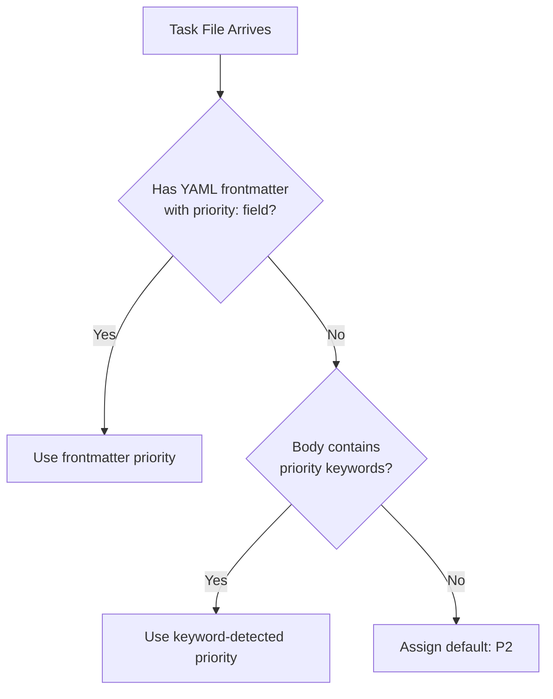
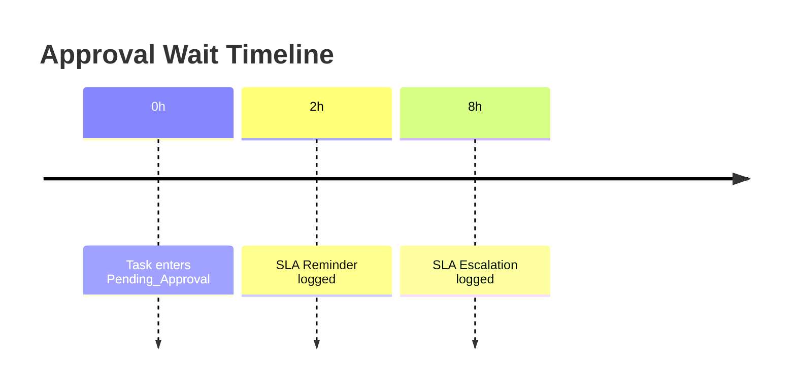

# SLA and Priority Model — Hakathone-0 (Digital FTE)

This document defines how tasks are prioritized, how SLA deadlines are computed and tracked, and how compliance is measured across the system.

---

## 1. Priority Levels

The system uses a 4-level priority scheme (P0-P3), defined in `config.yaml`:

| Priority | Label | SLA Window | Description |
|----------|-------|-----------|-------------|
| **P0** | Critical | 1 hour | System-down, data-loss, or urgent executive requests |
| **P1** | High | 4 hours | Time-sensitive business tasks, client-facing deadlines |
| **P2** | Medium | 24 hours | Standard work items, reports, routine requests |
| **P3** | Low | 72 hours | Backlog items, internal improvements, non-urgent |

**Default priority:** P2 (Medium) — assigned when no priority is specified or detected.

## 2. Priority Assignment

Priority is determined through a three-step fallback chain:



### 2.1 Frontmatter Detection

If the task file contains YAML frontmatter with a `priority:` field, that value is used directly.

```yaml
---
priority: P1
---
Task content here...
```

### 2.2 Keyword Auto-Detection

If no frontmatter priority exists, the task body is scanned for keywords:

| Keyword | Assigned Priority |
|---------|------------------|
| `urgent` | P0 (Critical) |
| `critical` | P0 (Critical) |
| `asap` | P1 (High) |
| `deadline` | P1 (High) |

Keywords are matched case-insensitively. The highest-priority keyword match wins.

### 2.3 Priority Queue Processing

When the watcher starts (or restarts), existing tasks in `/Needs_Action/` are sorted by priority before processing:

```
P0 tasks first → P1 → P2 → P3 last
```

New tasks arriving while the watcher is running are processed immediately via the `on_created` event (FIFO within real-time arrivals).

## 3. SLA Deadline Calculation

SLA deadlines are computed at the moment a task is detected:

```
sla_deadline = detected_at + sla_hours(priority)
```

| Input | Source |
|-------|--------|
| `detected_at` | `datetime.now()` when watcher detects the file |
| `sla_hours` | Looked up from `config.yaml` priority table |

The deadline is stored in the completed task's YAML frontmatter:

```yaml
---
priority: P1
detected_at: "2026-02-14 22:49"
sla_deadline: "2026-02-15 02:49"
---
```

## 4. SLA Tracking and Enforcement

### 4.1 Approval Wait Monitoring

For tasks waiting in `/Pending_Approval/`, the watcher periodically checks elapsed time:

| Threshold | Action | Config Key |
|-----------|--------|-----------|
| 2 hours | Log reminder | `sla.reminder_after_hours` |
| 8 hours | Log escalation | `sla.escalation_after_hours` |



> **Limitation:** Reminders and escalations are log entries only. No notifications are delivered to any human. The approver must manually check `/Pending_Approval/` or review logs.

### 4.2 Compliance Calculation

SLA compliance is calculated in two places:

1. **Dashboard** (`update_dashboard.py`) — Real-time compliance percentage
2. **Weekly Audit** (`weekly_audit.py`) — Period compliance with breakdown

Formula:

```
SLA Compliance % = (on-time completions / total tasks with SLA tracking) × 100
```

A task is **on-time** if `completed_at <= sla_deadline`. A task is **breached** if `completed_at > sla_deadline`.

### 4.3 Current Performance

| Metric | Value (as of 2026-02-14) |
|--------|--------------------------|
| Total tasks tracked | 12 |
| On-time completions | 9 |
| SLA compliance | 75% |
| SLA reminders triggered | 0 |
| SLA escalations triggered | 0 |

## 5. Priority Distribution Tracking

The dashboard tracks priority distribution with visual bars:

```
P0 (Critical):  0
P1 (High):     ██████████ 6
P2 (Medium):   ████████ 5
P3 (Low):      █ 1
```

The weekly audit breaks down priorities by period for trend analysis.

## 6. SLA Configuration Reference

All SLA-related settings from `config.yaml`:

```yaml
priority:
  P0:
    label: Critical
    sla_hours: 1
  P1:
    label: High
    sla_hours: 4
  P2:
    label: Medium
    sla_hours: 24
  P3:
    label: Low
    sla_hours: 72
  default: P2
  keywords:
    urgent: P0
    asap: P1
    critical: P0
    deadline: P1

sla:
  reminder_after_hours: 2
  escalation_after_hours: 8
```

## 7. Limitations

| Limitation | Detail |
|------------|--------|
| No predictive SLA | Cannot forecast breaches before they happen |
| No dynamic re-prioritization | Priority is assigned once at detection; does not change |
| No SLA breach alerts | Breaches are recorded in audit but not actively notified |
| Approval wait not subtracted | Time waiting for approval counts against SLA |
| No priority preemption | A P0 arriving during P3 processing must wait for P3 to finish |

---

*Generated by AI Employee (Digital FTE) on 2026-02-15 | Silver Tier*
