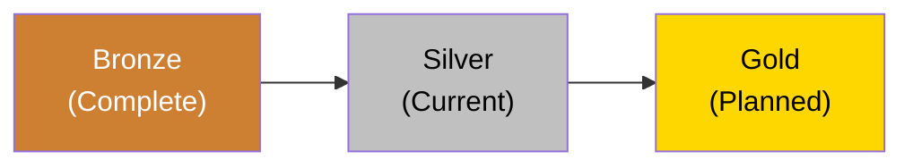
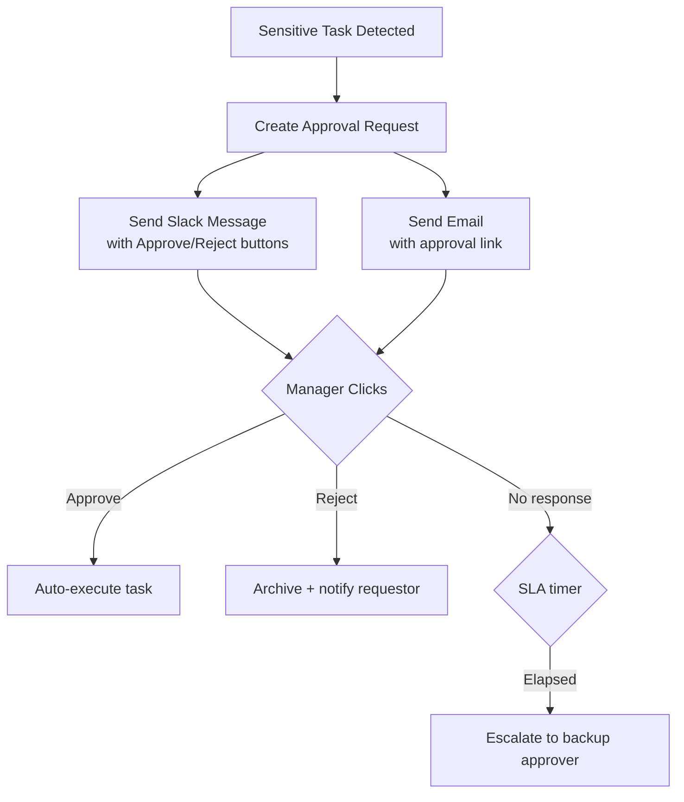
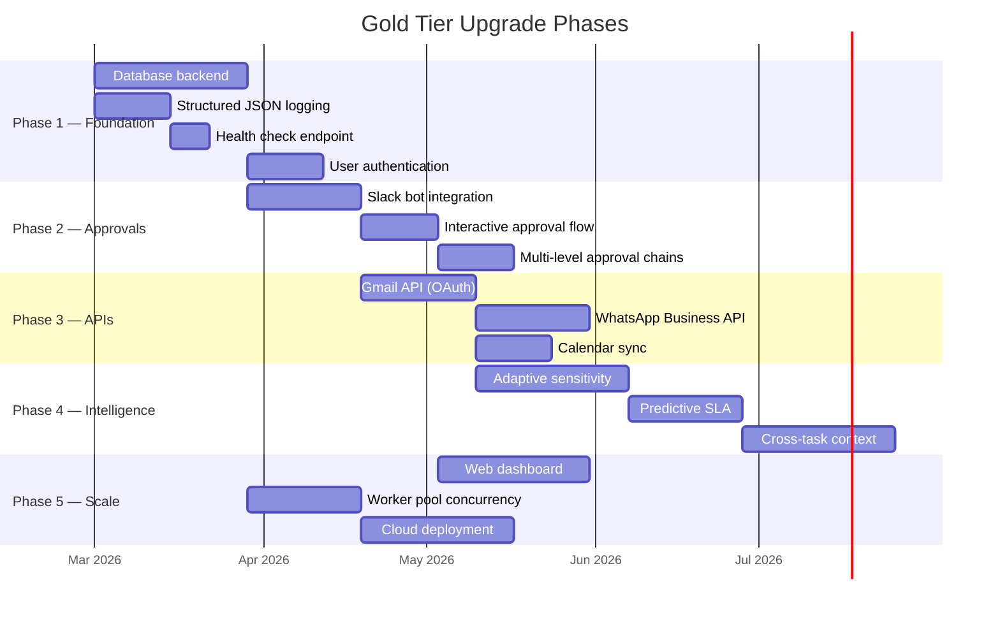

# Upgrade Roadmap — Hakathone-0 (Digital FTE)

This document outlines the upgrade path from the current Silver Tier to the Gold Tier. All items listed under "Current State" are implemented and operational. All items under "Gold Tier" are planned but **not yet built**.

> **Disclaimer:** All features described under Gold Tier are **planned upgrades only**. They are not implemented. The current system operates at Silver Tier with simulated APIs and file-based workflows.

---

## 1. Tier Progression Summary

| Dimension | Bronze (Complete) | Silver (Current) | Gold (Planned) |
|-----------|-------------------|-------------------|----------------|
| **Automation** | Manual trigger | File watcher + scheduler + auto-retry | Event-driven + API webhooks + worker pool |
| **Priority** | None | P0–P3 with SLA tracking | Predictive SLA + dynamic re-prioritization |
| **Sensitivity** | Simple keyword list | Weighted scoring + context modifiers | Adaptive ML-tuned thresholds |
| **Approval** | All manual | Config-driven routing (folder-based) | Interactive (Slack/email) + multi-level chains |
| **Integrations** | None | Simulated channels (local JSON) | Real APIs (Gmail, Slack, CRM, payments) |
| **Autonomy** | LOW only | LOW / MEDIUM / HIGH (configurable) | Confidence-based adaptive autonomy |
| **Notifications** | None | Log-only reminders/escalations | Push/Slack/email alerts to real humans |
| **Dashboard** | None | Static markdown | Live web UI with charts and filtering |
| **Data Store** | Flat files | Flat files + JSON state | Database with transactions and history |
| **Deployment** | Local script | Local with process manager | Cloud service with HA and scaling |

## 2. What Silver Tier Delivers (Current State)

### 2.1 Implemented and Operational

| Component | Status | Key Detail |
|-----------|--------|-----------|
| Config-driven engine | Active | All settings from `config.yaml`; re-read on each task |
| File watcher | Active | `watchdog` observer with real-time `on_created` events |
| Priority queue (P0–P3) | Active | Frontmatter + keyword detection + configurable default |
| SLA tracking | Active | Deadline calculation, compliance reporting, reminder/escalation logging |
| Sensitivity scoring | Active | Weighted keywords (10 keywords, 0.0–1.0) + 8 boosters + 5 reducers |
| Autonomy model | Active | 3 levels (LOW/MEDIUM/HIGH); current: MEDIUM |
| Approval workflow | Active | Folder-based; structured approval request files |
| Cron scheduler | Active | `croniter`-based; persistent state in `scheduler_state.json` |
| Channel ingestion | Active | Gmail, WhatsApp, Social — **all simulated via local JSON** |
| Process manager | Active | Auto-restart with exponential backoff |
| Local reasoner fallback | Active | Basic processing when Claude CLI unavailable |
| Daily logs | Active | `/Logs/YYYY-MM-DD.md` per day |
| Weekly audit + CEO briefing | Active | Aggregated period report |
| Dashboard | Active | Static markdown regenerated on events |
| Retry logic | Active | Max 3 attempts, 2s→60s exponential backoff |

### 2.2 Silver Tier Limitations

| Limitation | Category |
|------------|----------|
| All external APIs are simulated (no real email, messaging, or social) | Integration |
| Notifications and escalations are log-only (nobody is actually alerted) | Notification |
| Approval requires manual file moves (no UI, no webhook, no notification) | Workflow |
| Single-threaded sequential processing (no concurrency) | Performance |
| No database (flat files only, no transactions) | Storage |
| No authentication or identity verification | Security |
| No real-time monitoring UI | Observability |
| No learning or adaptation from past actions | Intelligence |
| No health check endpoint | Operations |
| Logs are mutable; no integrity protection | Audit |

## 3. Gold Tier Upgrade Areas

### 3.1 Real API Integrations

| Integration | What It Enables | Prerequisite |
|-------------|----------------|--------------|
| Gmail API (OAuth 2.0) | Send/receive real emails, auto-draft replies, attach files | Google Cloud project, OAuth consent screen, token storage |
| WhatsApp Business API | Send/receive real messages, template messages, media | Meta Business account, BSP or Cloud API setup |
| Slack Bot | Real-time notifications, interactive approval buttons, status updates | Slack workspace, bot token, event subscriptions |
| Google Calendar API | Read/create meetings, check availability, send invites | Google API client, calendar scope permissions |
| CRM Connector | Read/update contacts, log interactions, track deals | Salesforce/HubSpot API credentials |
| Payment Gateway | Process invoices, verify payments, issue refunds | Stripe/PayPal API keys + strict approval gates |

### 3.2 Interactive Approval Workflow

Planned capabilities:
- Slack interactive messages with Approve/Reject buttons
- Email-based approvals via unique cryptographic links
- Mobile push notifications for P0/P1 tasks
- Multi-level approval chains (e.g., finance + manager for financial tasks)
- Auto-escalation to backup approver on timeout
- Cryptographic approval signatures with identity verification

### 3.3 Enhanced Autonomy

| Upgrade | Description |
|---------|------------|
| Adaptive sensitivity tuning | System learns from approval/rejection history to adjust keyword weights over time |
| Confidence-based routing | High-confidence routine tasks skip planning; low-confidence get extra review |
| Cross-task context awareness | Memory of related tasks, ongoing projects, and client history |
| Predictive SLA management | Forecast workload spikes and suggest priority adjustments before breaches |
| Multi-step autonomous workflows | Chain tasks (receive invoice → verify → draft payment → request approval → confirm) |

### 3.4 Infrastructure Upgrades

| Upgrade | Description |
|---------|------------|
| Database backend | SQLite or PostgreSQL for transaction-safe state, queryable history, rollback |
| Web dashboard | Live status page with real-time updates, charts, filtering, search |
| REST API layer | External systems submit tasks, check status, receive webhooks |
| Concurrent processing | Worker pool for parallel task execution with priority preemption |
| Cloud deployment | Docker/Kubernetes with auto-scaling and high availability |
| Observability stack | Prometheus metrics, structured JSON logging, distributed tracing |
| Health checks | HTTP endpoint to verify system status externally |

### 3.5 Security Upgrades

| Upgrade | Description |
|---------|------------|
| User authentication | Login system with role-based access control (RBAC) |
| Sandbox execution | Sensitive actions execute in isolated environment before committing |
| Dry-run mode | Preview full output without executing |
| Rollback capability | Undo completed actions if post-execution review finds issues |
| Rate limiting | Cap execution rates (e.g., max 5 external emails per hour) |
| Encrypted secrets vault | Secure storage for API keys, credentials, PII with access logging |
| Audit log integrity | Cryptographic hash chain or append-only log to prevent tampering |

## 4. Recommended Upgrade Sequence

### Phase Priority Rationale

| Phase | Focus | Rationale |
|-------|-------|-----------|
| 1. Foundation | Database, logging, health, auth | Unlocks all downstream features; transaction safety required for real APIs |
| 2. Approvals | Slack bot, interactive flow, chains | Biggest user-facing pain point (manual file moves → one-click approval) |
| 3. Real APIs | Gmail, WhatsApp, Calendar | Transforms system from simulation to production capability |
| 4. Intelligence | Adaptive scoring, prediction, context | Requires real operational data to tune; depends on database for history |
| 5. Scale | Web dashboard, concurrency, cloud | Only needed when task volume demands it; optimize after features stable |

## 5. Migration Considerations

| Concern | Mitigation Strategy |
|---------|-------------------|
| Data migration (files → database) | Write migration script to import existing flat files with full metadata preservation |
| Config compatibility | Gold tier config extends Silver tier YAML schema; no breaking changes |
| Rollback path | Keep file-based workflow as fallback if database is unavailable |
| API credential security | Encrypted vault for all API keys; never stored in `config.yaml` |
| Testing strategy | Shadow mode: run Gold and Silver in parallel, compare outputs before cutover |
| Downtime during migration | Blue-green deployment; Silver continues operating during Gold setup |

## 6. What Does NOT Change

These aspects remain consistent across tier upgrades:

| Aspect | Constant |
|--------|----------|
| `config.yaml` as source of truth | Extended but not replaced |
| Priority model (P0–P3) | Same 4-level scheme |
| Sensitivity scoring concept | Same keyword + context approach (upgraded weights) |
| Approval requirement principle | Sensitive tasks always require human oversight |
| Audit trail requirement | Every action logged; audit aggregation continues |
| Vault folder structure | Same logical folders; database supplements but does not replace |

---

*Generated by AI Employee (Digital FTE) on 2026-02-16 | Silver Tier v2.0*
